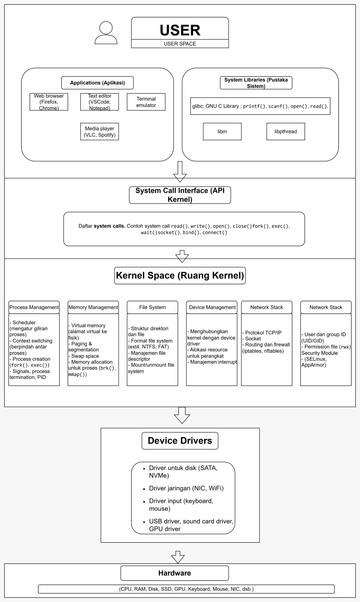
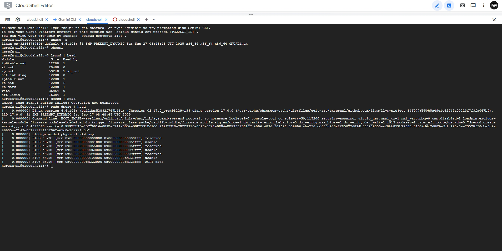

# Laporan Praktikum Minggu ke-1
Topik: [Tuliskan judul topik, misalnya "Arsitektur Sistem Operasi dan Kernel"]

---

## Identitas
- **Nama**  : Muhammad Fajri Abdullah 
- **NIM**   : 250202979
- **Kelas** : 1IKRB
---

## Tujuan
Tujuan praktikum minggu ini.  
Diharapkan mahasiswa mampu:
1. Menjelaskan peran sistem operasi dalam arsitektur komputer.
2. Mengidentifikasi komponen utama OS (kernel, system call, device driver, file system).
3. Membandingkan model arsitektur OS (monolithic, layered, microkernel).
4. Menggambarkan diagram sederhana arsitektur OS menggunakan alat bantu digital (draw.io / mermaid).
---

## Dasar Teori
Tuliskan ringkasan teori (3–5 poin) yang mendasari percobaan.

---

## Langkah Praktikum
1. Langkah-langkah yang dilakukan.  
2. Perintah yang dijalankan.  
3. File dan kode yang dibuat.  
4. Commit message yang digunakan.

---

## Kode / Perintah
Hasil dari input bedasrakan potongan kode atau perintah utama:
```bash
uname -a
lsmod | head
dmesg | head
```
```bash
Welcome to Cloud Shell! Type "help" to get started, or type "gemini" to try prompting with Gemini CLI.
To set your Cloud Platform project in this session use `gcloud config set project [PROJECT_ID]`.
You can view your projects by running `gcloud projects list`.
herefajri@cloudshell:~$ uname -a
Linux cs-32863767896-default 6.6.105+ #1 SMP PREEMPT_DYNAMIC Sat Sep 27 08:48:45 UTC 2025 x86_64 x86_64 x86_64 GNU/Linux
herefajri@cloudshell:~$ whoami
herefajri
herefajri@cloudshell:~$ lsmod | head
Module                  Size  Used by
ip6table_nat           12288  1
xt_set                 20480  0
ip_set                 53248  1 xt_set
netlink_diag           12288  0
iptable_nat            12288  1
xt_nat                 12288  6
xt_mark                12288  1
veth                   36864  0
nft_limit              16384  1
herefajri@cloudshell:~$ dmesg | head
dmesg: read kernel buffer failed: Operation not permitted
herefajri@cloudshell:~$ sudo dmesg | head
[    0.000000] Linux version 6.6.105+ (builder@2832f747b46d) (Chromium OS 17.0_pre498229-r33 clang version 17.0.0 (/var/cache/chromeos-cache/distfiles/egit-src/external/github.com/llvm/llvm-project 14f0776550b5a49e1c42f49a00213f7f3fa047bf), LLD 17.0.0) #1 SMP PREEMPT_DYNAMIC Sat Sep 27 08:48:45 UTC 2025
[    0.000000] Command line: BOOT_IMAGE=/syslinux/vmlinuz.A init=/usr/lib/systemd/systemd rootwait ro noresume loglevel=7 console=tty1 console=ttyS0,115200 security=apparmor virtio_net.napi_tx=1 nmi_watchdog=0 csm.disabled=1 loadpin.exclude=kernel-module,firmware modules-load=loadpin_trigger firmware_class.path=/var/lib/nvidia/firmware module.sig_enforce=1 dm_verity.error_behavior=3 dm_verity.max_bios=-1 dm_verity.dev_wait=1 i915.modeset=1 cros_efi root=/dev/dm-0 "dm-mod.create=vroot,,,ro,0 4077568 verity 0 PARTUUID=7BCC9916-089B-5741-BDB4-BBF2531D61CC PARTUUID=7BCC9916-089B-5741-BDB4-BBF2531D61CC 4096 4096 509696 509696 sha256 cd005c970a2f850726894bf85289300eaf8bb857b72888c81584d6c76887edb1 495a0ee73578f50cbe5c9e99905ea2149e061977f71182962a65c0e169274c5b"
[    0.000000] BIOS-provided physical RAM map:
[    0.000000] BIOS-e820: [mem 0x0000000000000000-0x0000000000000fff] reserved
[    0.000000] BIOS-e820: [mem 0x0000000000001000-0x0000000000054fff] usable
[    0.000000] BIOS-e820: [mem 0x0000000000055000-0x000000000005ffff] reserved
[    0.000000] BIOS-e820: [mem 0x0000000000060000-0x0000000000097fff] usable
[    0.000000] BIOS-e820: [mem 0x0000000000098000-0x000000000009ffff] reserved
[    0.000000] BIOS-e820: [mem 0x0000000000100000-0x00000000bd221fff] usable
[    0.000000] BIOS-e820: [mem 0x00000000bd222000-0x00000000bd223fff] ACPI data
herefajri@cloudshell:~$ 
```


---

## Hasil Eksekusi
Sertakan screenshot hasil percobaan atau diagram:

.


---

## Analisis
- Jelaskan makna hasil percobaan.  
- Hubungkan hasil dengan teori (fungsi kernel, system call, arsitektur OS).  
- Apa perbedaan hasil di lingkungan OS berbeda (Linux vs Windows)?  

---

## Kesimpulan
Tuliskan 2–3 poin kesimpulan dari praktikum ini.

---

## Quiz
Quiz
Jawab pertanyaan berikut di bagian Quiz pada laporan:

1. Sebutkan tiga fungsi utama sistem operasi.
- OS bertugas sebagai manajer utama sistem yang mana mengemban tanggung jawab untuk mengirim atau mengirim kembali semua sumber-sumber yang tersedia di sistem
- OS menyediakan ruang atau jembatan agar user bisa berinteraksi dengan hardware
- OS mengelola jalannya suatu proses semua program dengan memastikan semuanya berjalan secara efisien dan tak saling menghalangi serta memanajemen keamanan sistem

2. Jelaskan perbedaan antara kernel mode dan user mode.
- User Mode memiliki eksekusi tindakan yang terbatas dikarenakan adanya batas yang jelas antara ruang User dan Kernel yang dipisahkan oleh beberapa sistem keamanan, salah satunya system call yang diawasi oleh Kernel. Andaikata ada situasi buruk terjadi seperti contohnya hal-hal yang ada keterkaitannya dengan aplikasi ilegal maka operasi akan berhenti karena adanya sistem keamanan tersebut, dan hanya menyebabkan suatu aplikasi berhenti. Sedangkan,
- Kernel Mode itu memiliki akses ke segala bidang bahkan yang paling dalam sekalipun dikarenakan yang beroperasi adalah Kernel atau Inti dari Kernel Mode itu. Tapi jikalau ada suatu tindakan yang berbahaya atau adanya kegagalan maka kerusakannya bisa sangat berbahaya bahkan bisa merusak kinerja sistem komputer.

3. Sebutkan contoh OS dengan arsitektur monolithic dan microkernel.
- Arsitektur Monolithic atau Layanan OS inti yang dijalankan di ruang Kernel Mode seperti Linux.
- Arsitektur Microkernel atau  Layanan OS dasar di Kernel Mode bahkan beberapa ada di User Mode, contohnya seperti Mach, QNX, MINIX.

---

## Refleksi Diri
Sesi refleksi terkait aktivitas praktikum dan yang berhubungan dengan pembelajaran dan penugasan Week-1 :
- Apa bagian yang paling menantang minggu ini?
Penggunaan pertama kalinya VSCode dan Git Bash untuk mengkaitkan folder dari komputer (File Manager) ke sistem GitHub  
- Bagaimana cara Anda mengatasinya?  
Dengan menginput letak permasalahan dengan bantuan AI (ChatGPT dan Gemini) serta bantuan dari teman-teman dalam bentuk penjelasan untuk memastikan aktivitas praktikum berjalan dan menghasilkan output yang sesuai standar penugasan
---

**Credit:**  
_Template laporan praktikum Sistem Operasi (SO-202501) – Universitas Putra Bangsa_
