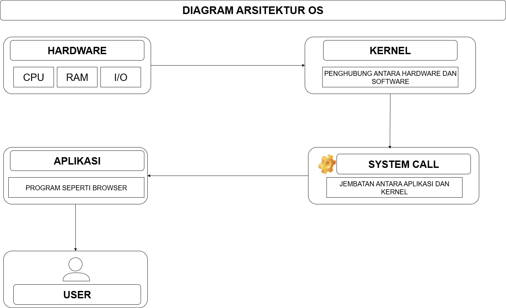

# Laporan Praktikum Minggu ke-1
Topik: [Tuliskan judul topik, misalnya "Arsitektur Sistem Operasi dan Kernel"]

---

## Identitas
- **Nama**  : Muhammad Fajri Abdullah 
- **NIM**   : 250202979
- **Kelas** : 1IKRB
---

## Tujuan
Tuliskan tujuan praktikum minggu ini.  
Contoh:  
> Mahasiswa mampu menjelaskan fungsi utama sistem operasi dan peran kernel serta system call.

---

## Dasar Teori
Tuliskan ringkasan teori (3–5 poin) yang mendasari percobaan.

---

## Langkah Praktikum
1. Langkah-langkah yang dilakukan.  
2. Perintah yang dijalankan.  
3. File dan kode yang dibuat.  
4. Commit message yang digunakan.

---

## Kode / Perintah
Tuliskan potongan kode atau perintah utama:
```bash
uname -a
lsmod | head
dmesg | head
```

---

## Hasil Eksekusi
Sertakan screenshot hasil percobaan atau diagram:


---

## Analisis
- Jelaskan makna hasil percobaan.  
- Hubungkan hasil dengan teori (fungsi kernel, system call, arsitektur OS).  
- Apa perbedaan hasil di lingkungan OS berbeda (Linux vs Windows)?  

---

## Kesimpulan
Tuliskan 2–3 poin kesimpulan dari praktikum ini.

---

## Quiz
Quiz
Jawab pertanyaan berikut di bagian Quiz pada laporan:

1. Sebutkan tiga fungsi utama sistem operasi.
- OS bertugas sebagai manajer utama sistem yang mana mengemban tanggung jawab untuk mengirim atau mengirim kembali semua sumber-sumber yang tersedia di sistem
- OS menyediakan ruang atau jembatan agar user bisa berinteraksi dengan hardware
- OS mengelola jalannya suatu proses semua program dengan memastikan semuanya berjalan secara efisien dan tak saling menghalangi serta memanajemen keamanan sistem

2. Jelaskan perbedaan antara kernel mode dan user mode.
- User Mode memiliki eksekusi tindakan yang terbatas dikarenakan adanya batas yang jelas antara ruang User dan Kernel yang dipisahkan oleh beberapa sistem keamanan, salah satunya system call yang diawasi oleh Kernel. Andaikata ada situasi buruk terjadi seperti contohnya hal-hal yang ada keterkaitannya dengan aplikasi ilegal maka operasi akan berhenti karena adanya sistem keamanan tersebut, dan hanya menyebabkan suatu aplikasi berhenti. Sedangkan,
- Kernel Mode itu memiliki akses ke segala bidang bahkan yang paling dalam sekalipun dikarenakan yang beroperasi adalah Kernel atau Inti dari Kernel Mode itu. Tapi jikalau ada suatu tindakan yang berbahaya atau adanya kegagalan maka kerusakannya bisa sangat berbahaya bahkan bisa merusak kinerja sistem komputer.

3. Sebutkan contoh OS dengan arsitektur monolithic dan microkernel.
- Arsitektur Monolithic atau Layanan OS inti yang dijalankan di ruang Kernel Mode seperti Linux.
- Arsitektur Microkernel atau  Layanan OS dasar di Kernel Mode bahkan beberapa ada di User Mode, contohnya seperti Mach, QNX, MINIX.

---

## Refleksi Diri
Tuliskan secara singkat:
- Apa bagian yang paling menantang minggu ini?  
- Bagaimana cara Anda mengatasinya?  

---

**Credit:**  
_Template laporan praktikum Sistem Operasi (SO-202501) – Universitas Putra Bangsa_
