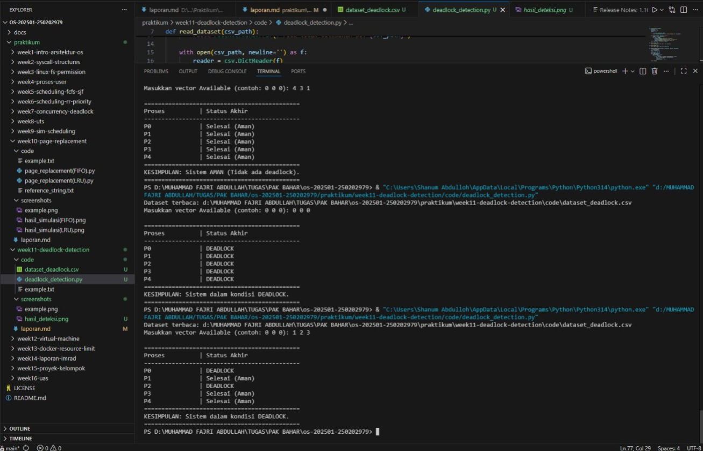

# Laporan Praktikum Minggu 11
Topik: Simulasi dan Deteksi Deadlock

---

## Identitas
- **Nama**  : Muhammad Fajri Abdullah 
- **NIM**   : 250202979
- **Kelas** : 1IKRB

---

## Tujuan
1. Membuat program sederhana untuk mendeteksi deadlock.  
2. Menjalankan simulasi deteksi deadlock dengan dataset uji.  
3. Menyajikan hasil analisis deadlock dalam bentuk tabel.  
4. Memberikan interpretasi hasil uji secara logis dan sistematis.  
5. Menyusun laporan praktikum sesuai format yang ditentukan.


---

## Dasar Teori
1. Deadlock adalah kondisi di mana proses saling menunggu resource sehingga tidak ada yang dapat melanjutkan eksekusi dan terjadi jika empat kondisi (mutual exclusion, hold and wait, no preemption, circular wait) terpenuhi.
2. Penanganan deadlock mencakup pencegahan, penghindaran, deteksi, dan pemulihan.
3. Deteksi deadlock dilakukan dengan algoritma berbasis wait-for graph untuk menemukan siklus.
4. Simulasi deadlock detection menggunakan dataset proses dan resource untuk menguji apakah sistem berada dalam kondisi deadlock.

---

## Langkah Praktikum
1. **Menyiapkan Dataset**

   Gunakan dataset sederhana yang berisi:
   - Daftar proses  
   - Resource Allocation  
   - Resource Request / Need

   Contoh tabel:

   | Proses | Allocation | Request |
   |:--:|:--:|:--:|
   | P1 | R1 | R2 |
   | P2 | R2 | R3 |
   | P3 | R3 | R1 |

2. **Implementasi Algoritma Deteksi Deadlock**

   Program minimal harus:
   - Membaca data proses dan resource.  
   - Menentukan apakah sistem berada dalam kondisi deadlock.  
   - Menampilkan proses mana saja yang terlibat deadlock.

3. **Eksekusi & Validasi**

   - Jalankan program dengan dataset uji.  
   - Validasi hasil deteksi dengan analisis manual/logis.  
   - Simpan hasil eksekusi dalam bentuk screenshot.

4. **Analisis Hasil**

   - Sajikan hasil deteksi dalam tabel (proses deadlock / tidak).  
   - Jelaskan mengapa deadlock terjadi atau tidak terjadi.  
   - Kaitkan hasil dengan teori deadlock (empat kondisi).

5. **Commit & Push**

   ```bash
   git add . 
   git commit -m "Minggu 11 - Deadlock Detection"
   git push origin main
   ```
---

## Kode / Perintah
Tuliskan potongan kode atau perintah utama:
```bash
import csv
import os

def parse_vector(s):
    return [int(x) for x in s.strip().split()]

def read_dataset(csv_path):
    processes = []
    allocation = []
    request = []
    
    if not os.path.exists(csv_path):
        raise FileNotFoundError(f"File tidak ditemukan di: {csv_path}")

    with open(csv_path, newline='') as f:
        reader = csv.DictReader(f)
        for row in reader:
            processes.append(row['Process'].strip())
            allocation.append(parse_vector(row['Allocation']))
            request.append(parse_vector(row['Request']))
    return processes, allocation, request

def vector_leq(a, b):
    return all(ai <= bi for ai, bi in zip(a, b))

def vector_add(a, b):
    return [ai + bi for ai, bi in zip(a, b)]

def deadlock_detection(processes, allocation, request, available):
    n = len(processes)
    work = available[:]
    finish = [False] * n

    made_progress = True
    while made_progress:
        made_progress = False
        for i in range(n):
            if not finish[i] and vector_leq(request[i], work):
                work = vector_add(work, allocation[i])
                finish[i] = True
                made_progress = True

    return finish

if __name__ == "__main__":
    base_path = os.path.dirname(os.path.abspath(__file__))
    csv_file = os.path.join(base_path, "dataset_deadlock.csv") 
    
    try:
        processes, allocation, request = read_dataset(csv_file)
        print(f"Dataset terbaca: {csv_file}")
        
        available_str = input("Masukkan vector Available (contoh: 0 0 0): ")
        available = parse_vector(available_str)

        finish_status = deadlock_detection(processes, allocation, request, available)

        print("\n" + "="*45)
        print(f"{'Proses':<15} | {'Status Akhir':<25}")
        print("-" * 45)
        
        is_system_deadlocked = False
        for i in range(len(processes)):
            status = "Selesai (Aman)" if finish_status[i] else "DEADLOCK"
            if not finish_status[i]:
                is_system_deadlocked = True
            print(f"{processes[i]:<15} | {status:<25}")
        
        print("="*45)
        if is_system_deadlocked:
            print("KESIMPULAN: Sistem dalam kondisi DEADLOCK.")
        else:
            print("KESIMPULAN: Sistem AMAN (Tidak ada deadlock).")
        print("="*45)

    except Exception as e:
        print(f"Error: {e}")
```

---

## Hasil Eksekusi
Sertakan screenshot hasil percobaan atau diagram:


---

## Analisis & Tugas

1. Dataset yang saya gunakan

   | Process | Allocation | Request |
   |---|---|---|
   | P0 | 0 1 0 | 7 4 3 |
   | P1 | 2 0 0 | 1 2 2 |
   | P2 | 3 0 2 | 6 0 0 |
   | P3 | 2 1 1 | 0 1 1 |
   | P4 | 0 0 2 | 4 3 1 |


2. Sajikan hasil deteksi dalam tabel (proses deadlock / tidak).  

Vector Available : 4 3 1

| Proses          | Status Akhir |
|---|---|
| P0              | Selesai (Aman) |
| P1              | Selesai (Aman) |
| P2              | Selesai (Aman) |
| P3              | Selesai (Aman) |
| P4              | Selesai (Aman) |


KESIMPULAN: Sistem AMAN (Tidak ada deadlock).

**#Penjelasan versi Trace Log** (bagian ini tidak ada dalam penugasan, hanya diperuntukkan agar pembaca dapat memahami cara kerja program deteksi deadlock dengan lebih mudah)
Available yang diinput User adalah 4 3 1.
- P0 gagal dipenuhi permintaannya, karena request yang diminta adalah 7 4 3.
- P1 gagal dipenuhi permintaannya, karena request yang diminta adalah 1 2 2, input 4 3 1 berstatus kurang 1 unit di bagian belakang.
- P2 gagal dipenuhi permintaannya, karena request yang diminta adalah 6 0 0.
- P3 berhasil dipenuhi permintaannya, input User dengan data 4 3 1 memenuhi request 0 1 1, maka P3 menambah nilai input dengan nilai yang ada pada kolom **Allocation** (4 3 1 + 2 1 1= 6 4 2).
- P4 berhasil terpenuhi permintaannya, P4 menambah nilai input dengan 0 0 2, status nilai input menjadi 6 4 4.
- Kembali.
- P0 belum terpenuhi.
- P1 terpenuhi, nilai input menjadi 8 4 4.
- P2 terpenuhi, nilai input bertambah menjadi 11 4 6.
- Kembali.
- P1 terpenuhi.
- Semua Proses terpenuhi.

**Penjelasan**
Sistem memulai pemeriksaan keamanan dengan nilai Available awal sebesar 4 3 1. Pada pemindaian pertama, sistem mengecek permintaan dari setiap proses:
   - P0 (Request 7 4 3), P1 (Request 1 2 2), dan P2 (Request 6 0 0) belum dapat dieksekusi karena sumber daya di gudang tidak mencukupi. Khusus untuk P1, meskipun dua angka pertama terpenuhi, sistem tetap menunda eksekusi karena kekurangan 1 unit pada sumber daya ketiga.
   - Satu-satunya proses yang dapat berjalan di awal adalah P3, karena permintaannya (0 1 1) lebih kecil dari sumber daya tersedia (4 3 1). Setelah P3 selesai, ia melepaskan kembali sumber daya yang dipegangnya (2 1 1), sehingga nilai Available meningkat menjadi 6 4 2.
- Dengan ketersediaan sumber daya yang baru (6 4 2), sistem melanjutkan pengecekan ke P4. Karena permintaan P4 (4 3 1) kini sudah terpenuhi, P4 dapat menyelesaikan tugasnya dan mengembalikan sumber daya (0 0 2) ke gudang, yang membuat nilai Available bertambah menjadi 6 4 4.
- Sistem kemudian melakukan pemindaian ulang (looping back) terhadap proses-proses yang sebelumnya tertunda. Dengan modal 6 4 4, permintaan P1 (1 2 2) kini terpenuhi. Selesainya P1 menambah sumber daya menjadi 8 4 4, yang kemudian cukup untuk memenuhi permintaan P2 (6 0 0) sehingga Available menjadi 11 4 6. Terakhir, P0 yang memiliki permintaan paling besar (7 4 3) akhirnya dapat dieksekusi dan diselesaikan.
- Kesimpulan: Karena ditemukan urutan eksekusi aman (P3 -> P4 -> P1 -> P2 -> P0), maka sistem dinyatakan berada dalam kondisi Aman (Safe State) dan terhindar dari Deadlock.

**Kaitan hasil dengan Teori Deadlock (4 kondisi: Mutual Exclusion (Eksklusi Saling), Hold and Wait (Menahan sambil menunggu), No Preemption (Tidak bisa direbut paksa), dan Circular Wait (Menunggu melingkar)):**
Berdasarkan hasil simulasi, fenomena deadlock atau kondisi aman dalam sistem ini dapat dijelaskan melalui empat kaitan kondisi utama:
- Mutual Exclusion (Eksklusi Saling): Kondisi ini terpenuhi karena setiap sumber daya (R1, R2, R3) yang didefinisikan dalam dataset bersifat non-sharable. Artinya, satu unit sumber daya hanya dapat digunakan oleh satu proses secara eksklusif pada satu waktu. Sebagai contoh, jika P1 sedang menggunakan sumber daya tersebut, P0 harus menunggu hingga sumber daya dilepaskan.
- Hold and Wait (Menahan Sambil Menunggu): Kondisi ini terlihat jelas pada data tabel di mana setiap proses sudah memegang sejumlah sumber daya tertentu (di kolom Allocation) namun tetap meminta tambahan sumber daya lainnya (di kolom Request). Contohnya, P2 sudah menahan sumber daya 3 0 2, namun ia tetap berada dalam status menunggu (wait) untuk mendapatkan tambahan 6 0 0 agar bisa selesai.
- No Preemption (Tidak Bisa Direbut Paksa): Dalam praktikum ini, sistem tidak memiliki mekanisme untuk mengambil paksa sumber daya yang sudah dialokasikan ke suatu proses. Sumber daya hanya bisa dilepaskan secara sukarela setelah proses tersebut berhasil menyelesaikan permintaannya. Inilah yang menyebabkan P0 atau P2 harus "antre" menunggu proses lain seperti P3 dan P4 selesai secara alami untuk mengembalikan sumber daya ke gudang.
- Circular Wait (Menunggu Melingkar):
   Pada Skenario Available 4 3 1: Kondisi ini tidak terpenuhi karena sistem berhasil menemukan rantai urutan aman (Safe Sequence), sehingga tidak ada proses yang terjebak dalam siklus saling menunggu.

---

Vector Available : 0 0 0

| Proses          | Status Akhir |
|---|---|
| P0              | DEADLOCK |
| P1              | DEADLOCK |
| P2              | DEADLOCK |
| P3              | DEADLOCK |
| P4              | DEADLOCK |


KESIMPULAN: Sistem dalam kondisi DEADLOCK.

**Penjelasan :**
- Sistem melakukan pengujian dengan memberikan input Available sebesar 0 0 0. Hasilnya, sistem langsung terdeteksi berada dalam kondisi DEADLOCK dengan narasi sebagai berikut:
   - Kegagalan Inisialisasi: Sistem memulai pemindaian dari P0 hingga P4, namun tidak menemukan satu pun proses yang dapat dieksekusi. Hal ini dikarenakan setiap proses (P0-P4) memiliki Request minimal satu unit pada salah satu jenis sumber daya, sedangkan di gudang (Available) tidak ada sumber daya yang tersisa sama sekali (0 0 0).
   - Ketiadaan Pemicu (No Safe Sequence): Karena tidak ada proses "pembuka" yang bisa berjalan, maka tidak ada proses yang dapat menyelesaikan tugasnya dan mengembalikan sumber daya yang sedang mereka pegang (Allocation) kembali ke sistem.
   - Kondisi Saling Menunggu: Akibatnya, P0 menunggu P3, P3 menunggu P4, dan seterusnya, tanpa ada kepastian kapan sumber daya akan tersedia. Karena tidak ada proses yang bisa berubah status menjadi Selesai, sistem terjebak dalam kondisi statis.
- Kesimpulan: Input 0 0 0 menyebabkan sistem gagal menemukan urutan aman (Safe Sequence). Karena semua proses tetap dalam status "Belum Selesai" hingga akhir pemindaian, sistem menyimpulkan bahwa telah terjadi Deadlock pada seluruh proses.

**Kaitan hasil dengan Teori Deadlock (4 kondisi: Mutual Exclusion (Eksklusi Saling), Hold and Wait (Menahan sambil menunggu), No Preemption (Tidak bisa direbut paksa), dan Circular Wait (Menunggu melingkar)):**
Sistem terdeteksi mengalami deadlock karena seluruh 4 syarat utama terpenuhi secara bersamaan:
- Mutual Exclusion (Eksklusi Saling): Sumber daya yang diminta oleh proses (P0-P4) bersifat terbatas dan tidak dapat digunakan bersama. Karena nilai Available adalah 0 0 0, tidak ada satu pun sumber daya yang bisa dialokasikan, sementara sumber daya yang sudah ada di kolom Allocation dikunci sepenuhnya oleh proses masing-masing.
- Hold and Wait (Menahan Sambil Menunggu): Kondisi ini menjadi penyebab utama kemacetan di skenario ini. Setiap proses saat ini sedang memegang (hold) sumber daya tertentu, namun mereka semua berada dalam status menunggu (wait) untuk mendapatkan tambahan sumber daya dari kolom Request yang stoknya kosong (0 0 0). Karena tidak ada proses yang mau melepaskan apa yang mereka pegang sebelum permintaan tambahan terpenuhi, sistem berhenti total.
- No Preemption (Tidak Bisa Direbut Paksa): Sistem operasi tidak memiliki otoritas untuk mengambil paksa sumber daya dari tangan proses-proses yang sedang berjalan. Karena sistem hanya menunggu proses melepaskan sumber daya secara sukarela setelah selesai, sementara tidak ada proses yang bisa selesai tanpa tambahan sumber daya, maka terjadi kebuntuan permanen.
- Circular Wait (Menunggu Melingkar): Dalam skenario 0 0 0, kondisi ini tercipta secara sempurna. Seluruh proses (P0 hingga P4) membentuk rantai saling menunggu yang melingkar; tidak ada satupun proses yang bisa menjadi "pemicu" untuk memutus rantai tersebut karena semua Request tidak ada yang bernilai nol (semua butuh minimal satu resource tambahan).

---

## Kesimpulan
- Keberadaan deadlock sangat bergantung pada jumlah sumber daya bebas (Available) dibandingkan dengan permintaan proses (Request).
- Sistem dinyatakan bebas dari deadlock jika dan hanya jika ditemukan sebuah urutan eksekusi (Safe Sequence) di mana setiap proses dapat menyelesaikan tugasnya dan mengembalikan sumber daya ke gudang.
- Uji coba ini membuktikan bahwa deadlock terjadi ketika empat kondisi (Mutual Exclusion, Hold and Wait, No Preemption, dan Circular Wait) terpenuhi secara simultan/bersamaan.

---

## Quiz
1. Apa perbedaan antara *deadlock prevention*, *avoidance*, dan *detection*?
   **Jawaban:**  
   - Deadlock Prevention (Pencegahan) bekerja dengan memastikan bahwa setidaknya satu dari empat syarat utama deadlock tidak dapat terpenuhi sama sekali. Caranya sangat ketat, seperti melarang proses memegang sumber daya sambil menunggu yang lain (Hold and Wait).
   - Deadlock Avoidance (Penghindaran) bekerja dengan mengandalkan sistem. Sistem akan memeriksa setiap permintaan sumber daya secara terus-menerus. Jika suatu permintaan berpotensi membawa sistem ke kondisi tidak aman (Unsafe State), maka permintaan tersebut ditunda, meskipun sumber dayanya sebenarnya tersedia (seperti prinsip Algoritma Banker).
   - Deadlock Detection (Deteksi) bekerja dengan sistem membiarkan deadlock terjadi, namun secara berkala menjalankan algoritma untuk memeriksa apakah ada proses yang terjebak. Seperti dalam praktikum Anda, sistem hanya mengidentifikasi siapa yang terkena deadlock setelah kondisi buntu benar-benar terjadi.

2. Mengapa deteksi deadlock tetap diperlukan dalam sistem operasi?
   **Jawaban:**  
   - Efisiensi sumber daya, karena metode pencegahan seringkali terlalu kaku dan membuat sumber daya banyak menganggur karena aturan yang sangat ketat.
   - Biaya overhead yang rendah, penghindaran (Avoidance) memerlukan perhitungan rumit setiap kali ada permintaan, sedangkan deteksi hanya dijalankan sesekali sehingga tidak membebani kinerja harian sistem secara berlebihan.
   - Kondisi tak terduga, dalam sistem yang kompleks dengan banyak proses dinamis, tidak semua potensi deadlock bisa diprediksi di awal, sehingga mekanisme deteksi menjadi "jaring pengaman" terakhir untuk memulihkan sistem jika terjadi kebuntuan.

3. Apa kelebihan dan kekurangan pendekatan deteksi deadlock?
   **Jawaban:** 
   Kelebihan: 
   - Kinerja optimal, selama tidak terjadi deadlock, sistem bekerja dengan kecepatan penuh tanpa beban pengecekan aturan yang rumit di setiap detik.
   - Proses dapat berjalan secara bebas (fleksibel) dan meminta sumber daya kapan saja tanpa harus menunggu izin prediksi yang kompleks.Kekurangan:
   - Risiko kehilangan kerja, jika deadlock terdeteksi, sistem terpaksa menghentikan atau membatalkan proses yang sedang berjalan, sehingga hasil kerja yang sudah dilakukan bisa hilang.
   - Proses "membersihkan" deadlock memerlukan sumber daya tambahan dan waktu, yang dapat mengganggu kenyamanan pengguna.


---

## Refleksi Diri
Tuliskan secara singkat:
- Apa bagian yang paling menantang minggu ini?  
- Bagaimana cara Anda mengatasinya?  

---

**Credit:**  
_Template laporan praktikum Sistem Operasi (SO-202501) – Universitas Putra Bangsa_
