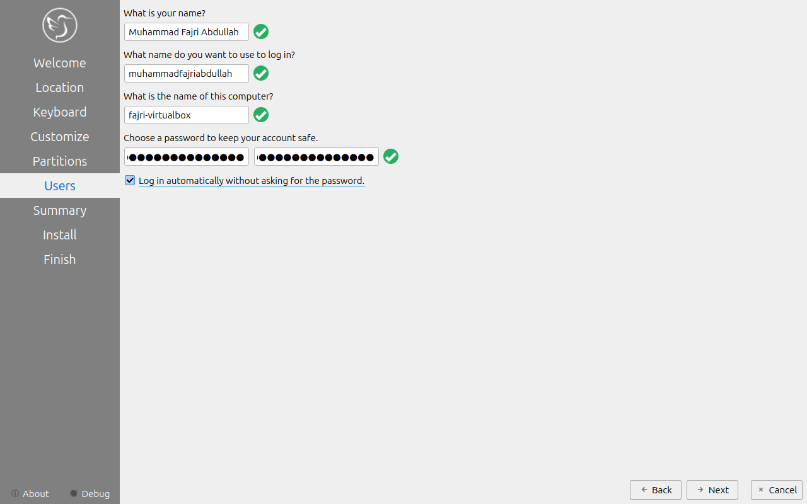
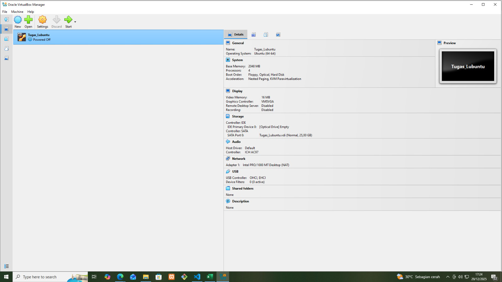
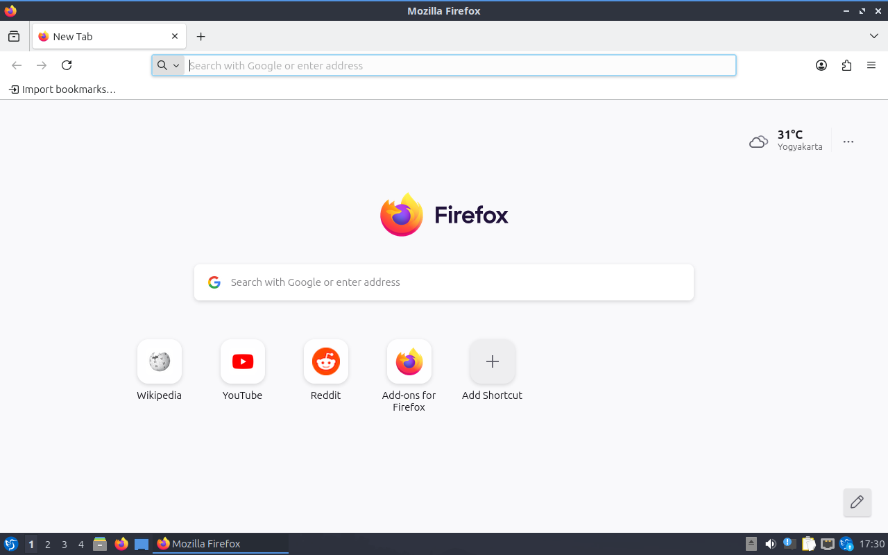

# Laporan Praktikum Minggu 12
Topik: Virtualisasi Menggunakan Virtual Machine 

---

## Identitas
- **Nama**  : Muhammad Fajri Abdullah 
- **NIM**   : 250202979
- **Kelas** : 1IKRB

---

## Tujuan
1. Menginstal perangkat lunak virtualisasi (VirtualBox/VMware).  
2. Membuat dan menjalankan sistem operasi guest di dalam VM.  
3. Mengatur konfigurasi resource VM (CPU, RAM, storage).  
4. Menjelaskan mekanisme proteksi OS melalui virtualisasi.  
5. Menyusun laporan praktikum instalasi dan konfigurasi VM secara sistematis.

---

## Dasar Teori
1. Konsep Virtual Machine (VM): Virtual Machine diabstraksikan sebagai perangkat keras komputer (CPU, memori, disk) ke dalam beberapa lingkungan eksekusi yang berbeda. Sistem operasi guest (Lubuntu) berjalan di atas Virtual Machine Monitor (Hypervisor seperti VirtualBox) yang menciptakan ilusi bahwa OS tersebut memiliki perangkat kerasnya sendiri.
2. Isolasi dan Keamanan (Protection): Salah satu prinsip utama virtualisasi adalah isolasi total. Masalah atau crash yang terjadi pada sistem guest (seperti "lag parah" yang Anda alami) tidak akan mempengaruhi sistem host (Windows) atau VM lainnya karena setiap VM berjalan dalam lingkungannya sendiri yang terisolasi.
3. Alokasi Sumber Daya (Resource Allocation): Sistem operasi bertanggung jawab untuk mengelola resource seperti CPU dan RAM. Dalam virtualisasi, jumlah resource yang diberikan kepada VM diambil dari resource fisik sistem host. Perubahan jumlah CPU dan RAM yang Anda lakukan secara langsung mempengaruhi throughput dan waktu respons sistem guest.
4. Manajemen Memori dan Swapping: Ketika RAM (memori fisik) yang dialokasikan ke VM terlalu kecil (seperti saat Anda mencoba 1 GB), sistem akan melakukan swapping atau menggunakan area di secondary storage sebagai memori tambahan. Hal ini menyebabkan penurunan performa yang drastis karena kecepatan akses disk jauh lebih lambat dibandingkan RAM.
5. Multiprocessing Virtual: Dengan mengonfigurasi jumlah CPU lebih dari satu (misalnya 4 CPU), sistem operasi dapat menjalankan beberapa instruksi secara paralel. Ini meningkatkan kemampuan sistem dalam menangani beban kerja berat meskipun memori fisik yang tersedia terbatas.

---

## Langkah Praktikum
1. **Instalasi Virtual Machine**
   - Instal VirtualBox atau VMware pada komputer host.  
   - Pastikan fitur virtualisasi (VT-x / AMD-V) aktif di BIOS.

2. **Pembuatan OS Guest**
   - Buat VM baru dan pilih OS guest (disini saya menggunakan Oracle Virtual Box dan Lubuntu 24.04.3).  
   - Atur resource awal:
     - CPU: 1–2 core  
     - RAM: 2–4 GB  
     - Storage: ≥ 20 GB 

3. **Instalasi Sistem Operasi**
   - Jalankan proses instalasi OS guest sampai selesai.  
   - Pastikan OS guest dapat login dan berjalan normal.

4. **Konfigurasi Resource**
   - Ubah konfigurasi CPU dan RAM.  
   - Amati perbedaan performa sebelum dan sesudah perubahan resource.

5. **Analisis Proteksi OS**
   - Jelaskan bagaimana VM menyediakan isolasi antara host dan guest.  
   - Kaitkan dengan konsep *sandboxing* dan *hardening* OS.

6. **Dokumentasi**
   - Ambil screenshot setiap tahap penting.  
   - Simpan di folder `screenshots/`.

7. **Commit & Push**
   ```bash
   git add .
   git commit -m "Minggu 12 - Virtual Machine"
   git push origin main
   ```

---

## Hasil Eksekusi
Sertakan screenshot hasil percobaan atau diagram:


Gambar Konfigurasi Resource (RAM 1, CPU 2):


Gambar Konfigurasi Resource (RAM 2, CPU 4):



Gambar OS Guest Running (RAM 1, CPU 2):


Gambar OS Guest Running (RAM 2, CPU 4)



---

## Analisis 
- Jelaskan bagaimana VM menyediakan isolasi antara host dan guest.  
   **Jawaban:** 
   Virtual Machine (VM) menyediakan isolasi melalui lapisan abstraksi yang dikelola oleh Hypervisor (seperti VirtualBox). Isolasi ini bekerja pada beberapa level:
   - Isolasi Hardware: Hypervisor mengalokasikan sumber daya fisik (CPU, RAM, dan Disk) secara tersegmentasi. Perangkat lunak di dalam Guest OS tidak memiliki akses langsung ke perangkat keras fisik device user; ia hanya berinteraksi dengan "perangkat keras maya" yang disediakan oleh Hypervisor.
   - Isolasi Memori: Setiap VM berjalan dalam ruang alamat memori yang berbeda. Berdasarkan percobaan, meskipun Guest OS mengalami penurunan performa drastis akibat alokasi RAM yang minim (seperti pada skenario 1 GB), sistem Host tetap stabil karena memori yang digunakan oleh VM telah dikunci dan dipisahkan dari proses utama sistem Host.

- Kaitkan dengan konsep *sandboxing* dan *hardening* OS.
   **Jawaban:** 
   Sandboxing adalah teknik keamanan yang membatasi lingkungan eksekusi sebuah program untuk mencegah kerusakan pada sistem di luar lingkungan tersebut.
   - Penerapan pada VM: Mesin virtual bertindak sebagai sistem sandbox yang menyeluruh. Segala perubahan data, instalasi aplikasi, hingga potensi serangan malware di dalam Guest OS (Lubuntu) tetap terkurung di dalam file disk virtual (.vdi).
   - Integritas Data: Melalui sandboxing ini, device user terlindungi karena Guest OS tidak dapat membaca atau menulis data pada penyimpanan fisik Host tanpa izin eksplisit. Hal ini menjaga integritas data sistem utama dari aktivitas apa pun yang terjadi di dalam VM.
   Hardening adalah proses memperkuat keamanan sistem dengan mengurangi kerentanan melalui pembatasan fungsi dan sumber daya.
   - Pembatasan Resource sebagai Hardening: Mengonfigurasi batas RAM dan jumlah CPU (seperti perbandingan CPU 2/RAM 1GB vs CPU 4/RAM 2GB) adalah bentuk pengendalian sistem. Dengan membatasi resource, user dapat memastikan bahwa proses yang berjalan di dalam VM tidak akan melakukan serangan Denial of Service (DoS) terhadap Host dengan cara menghabiskan seluruh sumber daya perangkat.
   - Lingkungan yang Terkendali: Virtualisasi mendukung strategi hardening dengan memungkinkan pengoperasian OS yang hanya berisi layanan-layanan penting (minimal install), sehingga mengurangi "permukaan serangan" (attack surface) pada keseluruhan ekosistem perangkat.

---

## Kesimpulan
- Pentingnya Alokasi Resource yang Proporsional: Berdasarkan hasil eksperimen, alokasi sumber daya fisik (CPU dan RAM) sangat menentukan performa sistem operasi guest. Perbandingan antara konfigurasi minimal (2 CPU, 1 GB RAM) yang menyebabkan lag dengan konfigurasi maksimal (4 CPU, 2 GB RAM) yang sangat lancar membuktikan bahwa sistem operasi modern seperti Lubuntu membutuhkan ambang batas resource tertentu untuk bekerja secara optimal.
- Efektivitas Isolasi dan Keamanan Virtualisasi: Praktikum ini membuktikan keberhasilan konsep sandboxing dan isolasi pada Virtual Machine. Penurunan performa atau beban kerja berat di dalam Lubuntu tidak memberikan dampak negatif pada stabilitas sistem Windows (host), yang menunjukkan bahwa pembatasan sumber daya dan pemisahan lingkungan kerja berhasil melindungi sistem utama dari potensi kegagalan di dalam VM.
- Keberhasilan Instalasi dan Konfigurasi: Proses instalasi Lubuntu 24.04 LTS pada VirtualBox telah berhasil diselesaikan dengan identitas pengguna yang sesuai (muhammadfajriabdullah). Seluruh fitur dasar seperti peramban web dan manajemen file dapat berfungsi dengan baik, menandakan bahwa mesin virtual telah dikonfigurasi dengan benar di atas arsitektur hardware yang mendukung virtualisasi.

---

## Quiz
1. Apa perbedaan antara host OS dan guest OS? 
    **Jawaban:**  
      - Host OS adalah sistem operasi utama yang terinstal langsung pada perangkat keras fisik (seperti Windows pada laptop Samsung Anda). Host OS memiliki kendali penuh terhadap seluruh hardware dan bertanggung jawab untuk menjalankan aplikasi hypervisor.
      - Guest OS adalah sistem operasi yang berjalan di dalam lingkungan virtual (seperti Lubuntu). Guest OS terisolasi dari perangkat keras fisik dan hanya dapat mengakses sumber daya (CPU, RAM, Disk) yang telah dialokasikan atau dijatahkan oleh hypervisor.


2. Apa peran hypervisor dalam virtualisasi?  
    **Jawaban:**  
      Hypervisor (atau Virtual Machine Monitor) berperan sebagai lapisan perantara yang mengelola dan membagi sumber daya fisik dari host ke beberapa guest. Fungsi utamanya adalah melakukan abstraksi hardware, memastikan setiap VM merasa memiliki perangkat kerasnya sendiri, serta melakukan penjadwalan (scheduling) penggunaan CPU dan memori agar beberapa sistem operasi dapat berjalan secara paralel pada satu mesin fisik tanpa saling mengintervensi.


3. Mengapa virtualisasi meningkatkan keamanan sistem?    
    **Jawaban:**
      - Isolasi: Setiap VM berjalan dalam lingkungan yang terpisah. Jika guest OS terkena serangan malware atau mengalami kegagalan sistem, dampaknya tidak akan menyebar ke sistem host atau VM lainnya.
      - Sandboxing: Aktivitas di dalam VM dibatasi pada "kotak pasir" virtualnya sendiri. Hal ini memungkinkan pengguna untuk menguji aplikasi atau konfigurasi yang berisiko tinggi tanpa mengancam integritas data atau stabilitas sistem operasi utama pada perangkat fisik.


---

## Refleksi Diri
Tuliskan secara singkat:
- Apa bagian yang paling menantang minggu ini?  
- Bagaimana cara Anda mengatasinya?  

---

**Credit:**  
_Template laporan praktikum Sistem Operasi (SO-202501) – Universitas Putra Bangsa_
