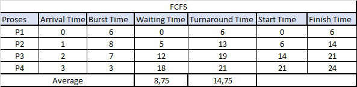

# Laporan Praktikum Minggu 14
Topik: Penyusunan Laporan Praktikum Format IMRAD

---

## Identitas
- **Nama**  : Muhammad Fajri Abdullah 
- **NIM**   : 250202979
- **Kelas** : 1IKRB
---

## Tujuan
1. Menyusun laporan praktikum dengan struktur ilmiah (Pendahuluan–Metode–Hasil–Pembahasan–Kesimpulan).
2. Menyajikan hasil uji dalam bentuk tabel dan/atau grafik yang jelas.
3. Menuliskan analisis hasil dengan argumentasi yang logis.
4. Menyusun sitasi dan daftar pustaka dengan format yang konsisten.
5. Mengunggah draft laporan ke repositori dengan rapi dan tepat waktu.
---
---
---

# Laporan Praktikum: Scheduling FCFS

## Pendahuluan (Introduction)

### 1. Latar Belakang
Dalam sistem operasi, CPU scheduling adalah mekanisme penting untuk mengatur urutan eksekusi proses agar penggunaan prosesor lebih efisien. Menurut Hajjar et al. (2024), algoritma First Come First Serve (FCFS) merupakan salah satu metode paling sederhana karena mengeksekusi proses sesuai urutan kedatangan, namun kelemahannya adalah munculnya convoy effect ketika proses dengan burst time panjang datang lebih awal.

Penelitian lain oleh Mohammadjafari dan Khajouie (2024) menekankan bahwa efisiensi penjadwalan sangat krusial dalam lingkungan komputasi heterogen, dan algoritma seperti FCFS sering dijadikan dasar perbandingan dengan metode lain yang lebih adaptif. Sementara itu, analisis komparatif oleh IJCSMC (2019) menunjukkan bahwa meskipun FCFS mudah diimplementasikan, algoritma Shortest Job First (SJF) lebih unggul dalam menurunkan rata-rata waktu tunggu.

Dengan demikian, praktikum ini berfokus pada implementasi dan analisis algoritma FCFS untuk memahami kelebihan, keterbatasan, serta relevansinya dibandingkan algoritma lain.


### 2. Rumusan Masalah
Berdasarkan latar belakang yang telah dijelaskan, maka rumusan masalah dalam praktikum ini adalah:
1. 	Bagaimana algoritma First Come First Serve (FCFS) menentukan urutan eksekusi proses berdasarkan arrival time dan burst time?
2. 	Sejauh mana kelemahan convoy effect pada FCFS memengaruhi rata-rata waiting time dan turnaround time proses ?
3. 	Bagaimana relevansi hasil uji FCFS dibandingkan dengan teori algoritma lain seperti Shortest Job First (SJF) yang lebih efisien dalam menurunkan waktu tunggu ?


### 3. Tujuan
Berdasarkan latar belakang dan rumusan masalah, praktikum ini memiliki tujuan sebagai berikut:
1. 	Mengimplementasikan algoritma FCFS pada dataset proses untuk memahami cara penjadwalan dilakukan berdasarkan arrival time dan burst time.
2. 	Mengukur dan menganalisis metrik performa seperti waiting time dan turnaround time untuk menilai dampak convoy effect pada algoritma FCFS.
3. 	Membandingkan hasil praktikum dengan teori algoritma lain, khususnya Shortest Job First (SJF), guna menilai relevansi efisiensi FCFS dalam konteks sistem operasi modern.

---

## Metode (Methods)

### 1. Lingkungan Uji
Eksperimen dijalankan menggunakan Visual Studio Code (VSCode) dengan interpreter Python 3.14 (64-bit) pada sistem operasi Windows.
Dataset proses disiapkan dalam format CSV dengan parameter arrival time dan burst time. Dataset berisi empat proses:


| PID | Arrival | Burst |
|---|---|---|
| P1 | 0 | 6 |
| P2 | 1 | 8 |
| P3 | 2 | 7 |
| P4 | 3 | 3 |


### 2. Langkah Eksperimen
Langkah Eksperimen
1. 	Menyusun dataset awal dalam format teks, kemudian dikonversi ke CSV.
2. 	Membuat program Python dengan modul  dan  untuk membaca dataset.
3. 	Mengimplementasikan algoritma First Come First Serve (FCFS) dengan logika:
   ```
   - Proses diurutkan berdasarkan arrival time.
   - Setiap proses diberi atribut start, finish, waiting time, dan turnaround time.
   - Waktu eksekusi diperbarui sesuai urutan proses.
   ```

4. 	Menjalankan program dan menampilkan hasil dalam bentuk tabel.
   - Program yang dijalankan:

   

```bash
import os
import csv

filename = os.path.join(os.path.dirname(__file__), "dataset.csv")

if not os.path.exists(filename):
    print(f"File '{filename}' tidak ditemukan.")
    exit()

def read_csv(filename):
    processes = []
    with open(filename, newline='') as f:
        reader = csv.DictReader(f)
        for row in reader:
            processes.append({
                'pid': row['PID'],
                'arrival': int(row['Arrival']),
                'burst': int(row['Burst'])
            })
    return processes

def fcfs(processes):
    processes.sort(key=lambda x: x['arrival'])
    time = 0
    for p in processes:
        p['start'] = max(time, p['arrival'])
        p['finish'] = p['start'] + p['burst']
        p['waiting'] = p['start'] - p['arrival']
        p['turnaround'] = p['finish'] - p['arrival']
        time = p['finish']
    return processes

def print_result(processes):
    print("PID\tArrival\tBurst\tStart\tFinish\tWaiting\tTurnaround")
    for p in processes:
        print(f"{p['pid']}\t{p['arrival']}\t{p['burst']}\t{p['start']}\t{p['finish']}\t{p['waiting']}\t{p['turnaround']}") 
              
        
if __name__ == "__main__": 
    processes = read_csv(filename) 
    result = fcfs(processes) 
    print_result(result)
   ```

5. 	Membandingkan hasil eksekusi program dengan perhitungan manual dari praktikum sebelumnya untuk memastikan konsistensi.

### 3. Parameter/Dataset


| PID | Arrival | Burst |
|---|---|---|
| P1 | 0 | 6 |
| P2 | 1 | 8 |
| P3 | 2 | 7 |
| P4 | 3 | 3 |

### 4. Cara pengukuran
1. Dalam Python, Saya menggunakan code dibawah ini sebagai pengukuran:
```bash
def fcfs(processes):
    processes.sort(key=lambda x: x['arrival'])
    time = 0
    for p in processes:
        p['start'] = max(time, p['arrival'])
        p['finish'] = p['start'] + p['burst']
        p['waiting'] = p['start'] - p['arrival']
        p['turnaround'] = p['finish'] - p['arrival']
        time = p['finish']
    return processes
```

2. Sedangkan, untuk pembanding (FCFS perhitungan manual pada Excel) dalam praktikum sebelumnya (Week-5), saya menggunakan rumus:
   
   - Start spesial untuk P1 = 0 atau sesuai dengan Arrival Time, dan untuk Start lainnya:
      - Start P2 didasarkan dari Finish P1
      - Start P3 didasarkan dari Finish P2
      - Start P4 didasarkan dari Finish P3
   - Finish spesial untuk P1 => Arrival Time + Burst Time, dan untuk Finish lainnya:
      - Finish P2 dihitung dari Start P2 + Burst Time P2
      - Finish P3 dihitung dari Start P3 + Burst Time P3
      - Finish P4 dihitung dari Start P4 + Burst Time P4

   - Waiting Time (WT) = waktu mulai eksekusi (Start) - Arrival Time
   - Turnaround Time (TAT) = WT + Burst Time

---

## Hasil 

### 1. Tabel Hasil Uji

#### Python (Didasarkan pada Praktikum Week-9):


#### Hasil dalam bentuk tabel:

| PID | Arrival | Burst | Start | Finish | Waiting | Turnaround |
   |---|---|---|---|---|---|---|
  | P1  |       0 |     6 |     0 |          6 |       0 |          6 |
  | P2  |       1 |     8 |     6 |         14 |       5 |         13 |
  | P3  |       2 |     7 |    14 |         21 |      12 |         19 |
  | P4  |       3 |     3 |    21 |         24 |      18 |         21 |


#### Excel (Pembanding) (Didasarkan pada Praktikum Week-5):



#### Hasil dalam bentuk tabel :

| Proses | Arrival Time | Burst Time | Waiting Time | Turnaround Time | Start Time | Finish Time |
|---|---|---|---|---|---|---|
| P1 | 0 | 6 | 0 | 6 | 0 | 6 |
| P2 | 1 | 8 | 5 | 13 | 6 | 14 |
| P3 | 2 | 7 | 12 | 19 | 14 | 21 |
| P4 | 3 | 3 | 18 | 21 | 21| 24 |

### Ringkasan Temuan
Hasil eksekusi algoritma First Come First Serve (FCFS) menunjukkan bahwa proses dijalankan sesuai urutan kedatangan (arrival time), dengan waktu mulai dan selesai yang konsisten antara hasil program Python dan perhitungan manual.

Nilai waiting time dan turnaround time untuk setiap proses identik di kedua metode, membuktikan bahwa implementasi program telah sesuai dengan teori dasar penjadwalan.
Rata-rata waiting time sebesar 8.75 dan turnaround time sebesar 14.75 menunjukkan bahwa proses dengan burst time besar (seperti P2 dan P3) menyebabkan proses kecil (P4) mengalami penundaan. Fenomena ini dikenal sebagai convoy effect, kelemahan utama FCFS.

Meskipun FCFS mudah diimplementasikan dan adil secara urutan kedatangan, hasil praktikum ini memperkuat temuan Mohammadjafari dan Khajouie (2024) bahwa algoritma seperti Shortest Job First (SJF) dapat menawarkan efisiensi waktu yang lebih baik dalam sistem komputasi modern.

---

## Pembahasan (Discussion)

### 1. Interpretasi Hasil
Hasil eksekusi algoritma First Come First Serve (FCFS) menunjukkan bahwa proses dijalankan sesuai urutan kedatangan (arrival time), bukan berdasarkan durasi eksekusi (burst time). Proses P1 dimulai pada waktu 0, diikuti oleh P2, P3, dan P4 sesuai urutan kedatangan. Nilai waiting time dan turnaround time yang dihasilkan oleh program Python identik dengan perhitungan manual di Excel, menunjukkan bahwa implementasi algoritma telah sesuai dengan teori dasar penjadwalan.

Rata-rata waiting time sebesar 8.75 dan turnaround time sebesar 14.75 mengindikasikan bahwa proses dengan burst time besar (P2 dan P3) menyebabkan proses kecil (P4) mengalami penundaan. Ini memperlihatkan efek antrian yang khas pada FCFS, di mana proses yang datang lebih awal akan dieksekusi terlebih dahulu meskipun durasinya panjang.

### 2. Keterbatasan
Kelemahan utama dari algoritma FCFS adalah munculnya convoy effect, yaitu kondisi di mana proses kecil tertunda karena harus menunggu proses besar yang datang lebih awal. Dalam hasil praktikum, proses P4 yang hanya membutuhkan 3 satuan waktu harus menunggu hingga waktu ke-21 untuk dieksekusi. Hal ini menyebabkan waiting time P4 mencapai 18, yang merupakan nilai tertinggi di antara semua proses. 

Menurut IJCSMC (2019), convoy effect merupakan kelemahan struktural FCFS yang dapat menurunkan efisiensi sistem, terutama dalam lingkungan multitasking atau real-time.

Selain itu, FCFS tidak mempertimbangkan prioritas atau durasi proses, sehingga tidak cocok untuk sistem yang membutuhkan respons cepat terhadap proses ringan atau kritis.

### 3. Perbandingan Teori/ Ekspektasi
Secara teoritis, algoritma Shortest Job First (SJF) bisa mengurangi rata-rata waktu tunggu dengan mengeksekusi proses yang memiliki durasi pendek terlebih dahulu. Dalam konteks dataset praktikum ini, jika SJF diterapkan, proses P4 mungkin akan dieksekusi lebih awal, sehingga waktu tunggunya akan jauh lebih rendah. 

Mohammadjafari dan Khajouie (2024) menyebutkan, bahwa algoritma seperti SJF lebih efisien dalam sistem heterogen dan bisa meningkatkan throughput (jumlah proses yang dapat diselesaikan dalam satuan waktu tertentu.) serta responsivitas sistem. 

Meskipun praktikum ini tidak menerapkan SJF secara langsung, hasil uji FCFS tetap relevan sebagai dasar pembelajaran dan perbandingan. FCFS menawarkan keadilan dalam urutan eksekusi, tetapi tidak menjamin efisiensi waktu yang optimal.

---

## Kesimpulan
1. Mengimplementasikan algoritma FCFS pada dataset proses berhasil dilakukan dengan Python. Program mengeksekusi proses sesuai urutan arrival time dan burst time, serta menghasilkan output yang konsisten dengan perhitungan manual, sehingga tujuan pertama tercapai.
2. Pengukuran metrik performa menunjukkan rata-rata waiting time sebesar 8.75 dan turnaround time sebesar 14.75. Nilai ini menegaskan adanya convoy effect, di mana proses dengan burst time panjang menyebabkan proses kecil tertunda. Analisis ini menjawab tujuan kedua.
3. Perbandingan dengan teori algoritma lain memperlihatkan bahwa meskipun FCFS sederhana dan adil, algoritma Shortest Job First (SJF) secara teoritis lebih efisien dalam menurunkan waktu tunggu. Hal ini menegaskan relevansi hasil praktikum dengan literatur sistem operasi modern, sehingga tujuan ketiga terpenuhi.


---

## Daftar Pustaka/ Referensi
1. Hajjar, O. F., Mekhallalati, E., Annwty, N., Alghayadh, F., Keshta, I., & Algabri, M. (2024). Performance assessment of CPU scheduling algorithms: A scenario-based approach with FCFS, RR, and SJF. Journal of Computer Science, 20(7). 
2. Mohammadjafari, A., & Khajouie, P. (2024). Optimizing task scheduling in heterogeneous computing environments: A comparative analysis of CPU, GPU, and ASIC platforms using E2C simulator. arXiv preprint arXiv:2405.08187. 
3. IJCSMC. (2019). Comparative analysis between First-Come-First-Serve (FCFS) and Shortest-Job-First (SJF) scheduling algorithms. International Journal of Computer Science and Mobile Computing, 8(6). 


---
---
---

## Quiz
1. Mengapa format IMRAD membantu membuat laporan praktikum lebih ilmiah dan mudah dievaluasi?

   **Jawaban:**  
    Format IMRAD (Introduction, Methods, Results, and Discussion) memberikan struktur yang sistematis sehingga laporan mudah dipahami, konsisten dengan standar akademik, dan memudahkan pembaca maupun dosen mengevaluasi setiap tahap penelitian atau praktikum secara terpisah. Dengan format ini, tujuan, metode, hasil, dan interpretasi dapat ditelusuri secara logis.

2. Apa perbedaan antara bagian **Hasil** dan **Pembahasan**?

   **Jawaban:**  
    Bagian Hasil hanya menyajikan data atau output eksperimen (misalnya tabel, grafik, atau screenshot) tanpa interpretasi. Sedangkan Pembahasan berfungsi untuk menafsirkan hasil tersebut, menjelaskan makna, keterbatasan, serta menghubungkannya dengan teori atau literatur yang relevan.


3. Mengapa sitasi dan daftar pustaka penting, bahkan untuk laporan praktikum? 

   **Jawaban:**  
    Sitasi dan daftar pustaka menunjukkan bahwa laporan didukung oleh sumber ilmiah yang kredibel, menghindari plagiarisme, serta memperkuat argumen dengan landasan teori. Bahkan dalam laporan praktikum, referensi membantu mengaitkan hasil dengan penelitian sebelumnya dan memberi konteks akademis yang lebih kuat.
---

**Credit:**  
_Template laporan praktikum Sistem Operasi (SO-202501) – Universitas Putra Bangsa_
