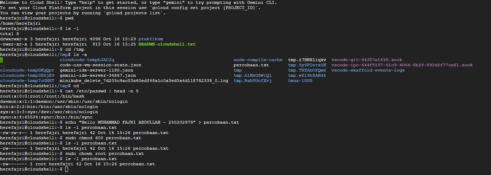

# Laporan Praktikum Minggu ke 3
Topik:  Manajemen File dan Permission di Linux

---

## Identitas
- **Nama**  : Muhammad Fajri Abdullah 
- **NIM**   : 250202979
- **Kelas** : 1IKRB

---

## Tujuan
Tuliskan tujuan praktikum minggu ini.  
Contoh:  
> Tujuan utama dari praktikum ini adalah agar mahasiswa mampu mengoperasikan perintah Linux dasar dengan benar, memahami sistem izin (permission), dan mendokumentasikan hasilnya dalam format laporan Git. Setelah menyelesaikan tugas ini,diharapkan para mahasiswa mampu:

- Menggunakan perintah ls, pwd, cd, cat untuk navigasi file dan direktori.
- Menggunakan chmod dan chown untuk manajemen hak akses file.
- Menjelaskan hasil output dari perintah Linux dasar.
- Menyusun laporan praktikum dengan struktur yang benar.
- Mengunggah dokumentasi hasil ke Git Repository tepat waktu.


---

## Dasar Teori
Tuliskan ringkasan teori (3–5 poin) yang mendasari percobaan.

---

## Langkah Praktikum
1. Langkah-langkah yang dilakukan.  
2. Perintah yang dijalankan.  
3. File dan kode yang dibuat.  
4. Commit message yang digunakan.

---

## Kode / Perintah
Tuliskan potongan kode atau perintah utama:
**1. Eksperimen 1 – Navigasi Sistem File**
```bash
pwd
ls -1
cd /tmp
ls -a
```

#pwd
```bash
herefajri@cloudshell:~$ pwd
/home/herefajri
```

#ls -1
```bash
herefajri@cloudshell:~$ ls -l
total 4
-rwxr-xr-x 1 herefajri herefajri 913 Oct 15 09:31 README-cloudshell.txt
```

#cd /tmp
 ```bash
herefajri@cloudshell:~$ cd /tmp
herefajri@cloudshell:/tmp$
```

#ls -a
```bash
herefajri@cloudshell:/tmp$ ls -a
.                     cloudcode-tempguPmuY                                            node-compile-cache  tmp.OqDkBJFEVa                                        vscode-skaffold-events-logs
..                    code-oss-vm-session-state.json                                  tmp                 tmp.RKaLrptHWp
cloudcode-temp0cZEhu  gemini-ide-server-40473.json                                    tmp.CBditOvVKN      tmux-1000
cloudcode-temp4LPnlR  gemini-ide-server-481.json                                      tmp.mtKrxx4rb9      vscode-git-7a51ddf9a8.sock
cloudcode-tempfLWQgl  minikube_delete_7d205c9ac03a60edf48a1c0a3ed3a4d118782338_0.log  tmp.mWrjcuheDd      vscode-ipc-137304b5-54df-496d-a9b7-7909a49cdea0.sock
herefajri@cloudshell:/tmp$
```


**2. Eksperimen 2 – Membaca File**
```bash
cat /etc/passwd | head -n 5
```

#cat /etc/passwd | head -n 5
```bash
herefajri@cloudshell:/tmp$ cat /etc/passwd | head -n 5
root:x:0:0:root:/root:/bin/bash
daemon:x:1:1:daemon:/usr/sbin:/usr/sbin/nologin
bin:x:2:2:bin:/bin:/usr/sbin/nologin
sys:x:3:3:sys:/dev:/usr/sbin/nologin
sync:x:4:65534:sync:/bin:/bin/sync
herefajri@cloudshell:/tmp$
```

**3. Eksperimen 3**
```bash
echo "Hello <NAME><NIM>" > percobaan.txt
ls -l percobaan.txt
chmod 600 percobaan.txt
ls -l percobaan.txt
```
```bash
herefajri@cloudshell:~$ echo "Hello MUHAMMAD FAJRI ABDULLAH - 250202979" > percobaan.txt
herefajri@cloudshell:~$ ls -l percobaan.txt
-rw-rw-r-- 1 herefajri herefajri 42 Oct 16 15:26 percobaan.txt
herefajri@cloudshell:~$ sudo chmod 600 percobaan.txt
herefajri@cloudshell:~$ ls -l percobaan.txt
-rw------- 1 herefajri herefajri 42 Oct 16 15:26 percobaan.txt
herefajri@cloudshell:~$
```

dan
```bash
sudo chown root percobaan.txt
ls -l percobaan.txt
```
```bash
herefajri@cloudshell:~$ sudo chown root percobaan.txt
herefajri@cloudshell:~$ ls -l percobaan.txt
-rw------- 1 root herefajri 42 Oct 16 15:26 percobaan.txt
herefajri@cloudshell:~$
```


echo "Hello Muhammad Fajri Abdullah 250202979" > percobaan.txt
ls -l percobaan.txt
chmod 600 percobaan.txt
ls -l percobaan.txt

---

## Hasil Eksekusi
Sertakan screenshot hasil percobaan atau diagram:


_**Bonus:**_



---

## Analisis
- Jelaskan makna hasil percobaan.  
- Hubungkan hasil dengan teori (fungsi kernel, system call, arsitektur OS).  
- Apa perbedaan hasil di lingkungan OS berbeda (Linux vs Windows)?  

## Analisis Hasil
Tugas
1. Dokumentasikan hasil seluruh perintah pada tabel observasi di laporan.md.


2. Jelaskan fungsi tiap perintah dan arti kolom permission (rwxr-xr--).


3. Analisis peran chmod dan chown dalam keamanan sistem Linux.


4. Upload hasil dan laporan ke repositori Git sebelum deadline.


---

## Kesimpulan
Tuliskan 2–3 poin kesimpulan dari praktikum ini.

---

## Quiz
1. Tuliskan jawaban di bagian Quiz pada laporan:
  **Jawaban:**  
2. Apa fungsi dari perintah chmod?
  **Jawaban:**  
3. Apa arti dari kode permission rwxr-xr--?
  **Jawaban:**  
4. Jelaskan perbedaan antara chown dan chmod.
  **Jawaban:**  

---

## Refleksi Diri
Tuliskan secara singkat:
- Apa bagian yang paling menantang minggu ini?  
- Bagaimana cara Anda mengatasinya?  

---

**Credit:**  
_Template laporan praktikum Sistem Operasi (SO-202501) – Universitas Putra Bangsa_
