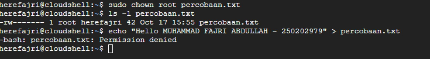
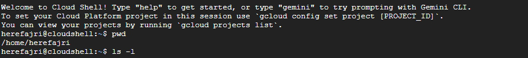
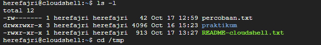
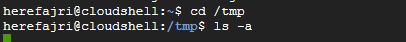
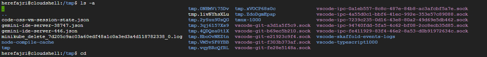
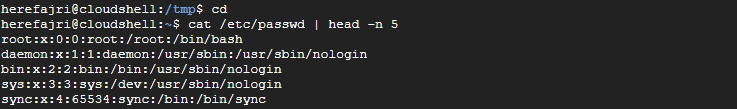
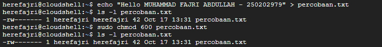
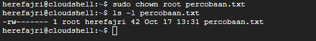
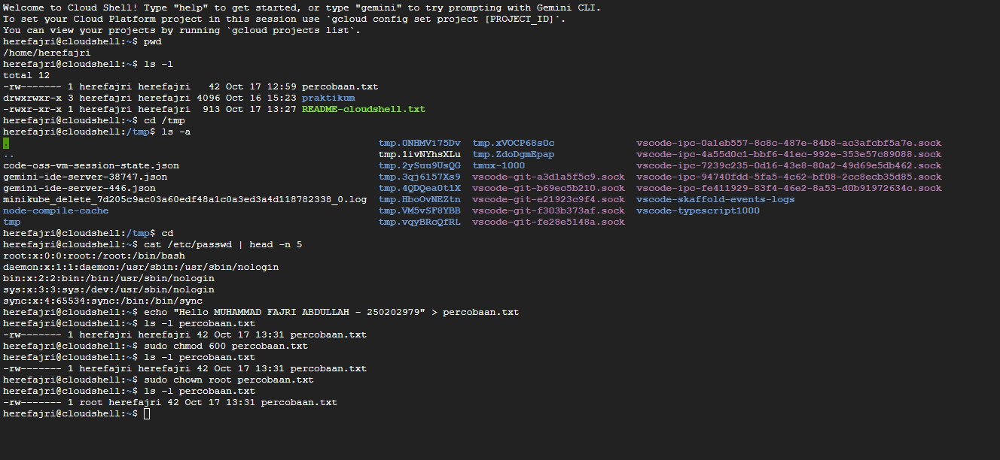

# Laporan Praktikum Minggu ke-3
Topik:  Manajemen File dan Permission di Linux

---

## Identitas
- **Nama**  : Muhammad Fajri Abdullah 
- **NIM**   : 250202979
- **Kelas** : 1IKRB

---

## Tujuan
Tuliskan tujuan praktikum minggu ini.  
Contoh:  
> Tujuan utama dari praktikum ini adalah agar mahasiswa mampu mengoperasikan perintah Linux dasar dengan benar, memahami sistem izin (permission), dan mendokumentasikan hasilnya dalam format laporan Git. Setelah menyelesaikan tugas ini,diharapkan para mahasiswa mampu:

- Menggunakan perintah ls, pwd, cd, cat untuk navigasi file dan direktori.
- Menggunakan chmod dan chown untuk manajemen hak akses file.
- Menjelaskan hasil output dari perintah Linux dasar.
- Menyusun laporan praktikum dengan struktur yang benar.
- Mengunggah dokumentasi hasil ke Git Repository tepat waktu.


---

## Dasar Teori
Tuliskan ringkasan teori (3–5 poin) yang mendasari percobaan.

-	File Permission (Izin File) adalah sistem aturan yang mengatur siapa yang diperbolehkan melakukan hal-hal layaknya read, write, dan execute, atas sebuah file ataupun direktori di sistem linux.
-	Linux membagi 3 tipe pihak peng-akses utama:
1.	Owner / Pemilik – Pemilik dari suatu file ataupun direktori.
2.	Group / Grup – Sekumpulan pengguna yang berada di suatu grup yang mana semuanya memiliki izin akses yang sama.
3.	Others – Semua pengguna lain yang mana bukan Owner dan juga bukan bagian dari Group.
-	Linux juga membagi 3 jenis izin utama:
1.	Read (r) – Izin untuk membaca/melihat isi file/direktori.
2.	Write (w) – Izin untuk mengubah atau bahkan menambahkan isi file maupun file ke direktori.
3.	Execute (x) – Izin untuk menjalankan file sebagai program/script.

Terinspirasi dari:
Sumber : Mengenal File Permission pada Linux Serta Contoh Penerapannya, Jetorbit, by Minz (https://www.jetorbit.com/panduan/mengenal-file-permission-pada-linux-serta-contoh-penerapannya/)

---

## Langkah Praktikum
1. Langkah-langkah yang dilakukan.
   **Jawaban:**
- Set-up Environment
  1. Gunakan Linux (Ubuntu/WSL/Shell Cloud Google).
  2. Pastikan folder kerja berada di dalam direktori repositori Git praktikum: 
  ```bash
     praktikum/week3-linux-fs-permission/
     ```
  3. Laksanakan beberapa eksperimen dibawah, beberapa perintah yang perlu diaplikasikan di Linux, dan juga perintah akan penjelasan, pencatatan, analisis hasil,dan semacanya.

- Eksperimen 1 – Navigasi Sistem File
   Jalankan perintah berikut:
   ```bash
   pwd
   ls -l
   cd /tmp
   ls -a
   ```
   - Jelaskan hasil tiap perintah.
   - Catat direktori aktif, isi folder, dan file tersembunyi (jika ada).

- Eksperimen 2 – Membaca File
   Jalankan perintah:
   ```bash
   cat /etc/passwd | head -n 5
   ```
   - Jelaskan isi file dan struktur barisnya (user, UID, GID, home, shell).

- Eksperimen 3 – Permission & Ownership
   Buat file baru:
   ```bash
   echo "Hello <NAME><NIM>" > percobaan.txt
   ls -l percobaan.txt
   chmod 600 percobaan.txt
   ls -l percobaan.txt
   ```
   - Analisis perbedaan sebelum dan sesudah chmod.  
   - Ubah pemilik file (jika memiliki izin sudo):
   ```bash
   sudo chown root percobaan.txt
   ls -l percobaan.txt
   ```
   - Catat hasilnya.

- Eksperimen 4 – Dokumentasi
   - Ambil screenshot hasil terminal dan simpan di:
     ```
     praktikum/week3-linux-fs-permission/screenshots/
     ```
   - Tambahkan analisis hasil pada `laporan.md`.

- Commit & Push
   ```bash
   git add .
   git commit -m "Minggu 3 - Linux File System & Permission"
   git push origin main
   ```

2. Perintah yang dijalankan.
   **Jawaban:**
- Eksperimen 1 – Navigasi Sistem File
   ```bash
   pwd
   ```
   ```bash
   ls -l
   ```
   ```bash
   cd /tmp
   ```
   ```bash
   ls -a
   ```

- Eksperimen 2 – Membaca File
   ```bash
   cat /etc/passwd | head -n 5
   ```

- Eksperimen 3 – Permission & Ownership
   ```bash
   echo "Hello <NAME><NIM>" > percobaan.txt
   ```
   ```bash
   ls -l percobaan.txt
   ```
   ```bash
   chmod 600 percobaan.txt
   ```
   ```bash
   ls -l percobaan.txt
   ```
  ```bash
   sudo chown root percobaan.txt
  ```
  ```bash
   ls -l percobaan.txt
   ```

3. File dan kode yang dibuat.
   **Jawaban:**
Code dijalankan di Shell Cloud Google dengan standar dokumentasi gambar adalah .png dan .txt untuk code. Bagian hasilnya bisa dilihat pada bagian **Hasil EKsekusi** atau ke Folder `/screenshots` untuk dokumentasi gambar dengan standar .png dan **Analisis Hasil** atau Folder `/code` untuk melihat dokumentasi code dengan standar .txt.


   
4. Commit message yang digunakan.
   **Jawaban:**
Commit message yang saya gunakan adalah Update laporan.md

---

## Kode / Perintah
Tuliskan potongan kode atau perintah utama:
**1. Eksperimen 1 – Navigasi Sistem File**
```bash
pwd
ls -l
cd /tmp
ls -a
```


~~

#pwd
```bash
herefajri@cloudshell:~$ pwd
/home/herefajri
```
**Penjelasan Hasil**
- `pwd` adalah singkatan dari "Print Working Directory".
-  Pada hasil I/O diatas bisa dilihat ada bagian `/home/herefajri` yang mana artinya posisi direktori sedang ada di directory home milik Owner `herefajri`.
~~

#ls -l
```bash
herefajri@cloudshell:~$ ls -l
total 12
-rw------- 1 herefajri herefajri   42 Oct 17 12:59 percobaan.txt
drwxrwxr-x 3 herefajri herefajri 4096 Oct 16 15:23 praktikum
-rwxr-xr-x 1 herefajri herefajri  913 Oct 17 13:27 README-cloudshell.txt
```
**Penjelasan Hasil**
- Pada `total 12` menunjukkan seluruh isi direktori seperti file dan folder menggunakan 12 blok disk.
- Pada `-rw------- 1 root herefajri 42 Oct 16 15:26 percobaan.txt` file ini hanya bisa diakses (baik dibaca maupun ditulis) oleh Owner `root`. Group dan Others tak punya akses sama sekali.
- Pada `drwxrwxr-x 3 herefajri herefajri 4096 Oct 16 15:23 praktikum` folder ini mempunyai akses penuh untuk Owner dan Group, namum tidak untuk Others yang mana bukan bagian dari Group dan hanya bisa baca dan eksekusi.
- Pada `-rwxr-xr-x 1 herefajri herefajri 913 Oct 17 12:50 README-cloudshell.txt` yang mana titik utamanya pada `README-cloudshell.txt` yaitu file yang bisa dibaca oleh publik baik Others maupun Group, namun untuk menulis hanya Owner yang mempunyai akses.
~~

#cd /tmp
 ```bash
herefajri@cloudshell:~$ cd /tmp
herefajri@cloudshell:/tmp$
```
**Penjelasan Hasil**
- Direktori aktif berpindah ke `/tmp` yang mana adalah direktori yang digunakan sistem dan aplikasi untuk menyimpan file dalam jangka waktu sementara.

~~

#ls -a
```bash
herefajri@cloudshell:/tmp$ ls -a
.                                                               tmp.0NHMVi75Dv  tmp.xVOCP68s0c              vscode-ipc-0a1eb557-8c8c-487e-84b8-ac3afcbf5a7e.sock
..                                                              tmp.1ivNYhsXLu  tmp.ZdoDgmEpap              vscode-ipc-4a55d0c1-bbf6-41ec-992e-353e57c89088.sock
code-oss-vm-session-state.json                                  tmp.2ySuu9UsQG  tmux-1000                   vscode-ipc-7239c235-0d16-43e8-80a2-49d69e5db462.sock
gemini-ide-server-38747.json                                    tmp.3qj6157Xs9  vscode-git-a3d1a5f5c9.sock  vscode-ipc-94740fdd-5fa5-4c62-bf08-2cc8ecb35d85.sock
gemini-ide-server-446.json                                      tmp.4QDQea0t1X  vscode-git-b69ec5b210.sock  vscode-ipc-fe411929-83f4-46e2-8a53-d0b91972634c.sock
minikube_delete_7d205c9ac03a60edf48a1c0a3ed3a4d118782338_0.log  tmp.HboOvNEZtn  vscode-git-e21923c9f4.sock  vscode-skaffold-events-logs
node-compile-cache                                              tmp.VM5vSF8YBB  vscode-git-f303b373af.sock  vscode-typescript1000
tmp                                                             tmp.vqyBRcQfRL  vscode-git-fe28e5148a.sock
```
**Penjelasan Hasil**
- `.` menunjukkan direktori saat ini dengan status tetap di `/home/herefajri/praktikum`.
- `..` menunjukkan direktori induk (satu tingkat diatas direktori saat ini) dengan status pindah dari `/home/herefajri/praktikum` ke `/home/herefajri`.
- Bagian-bagian seperti `tmp.0...... (dan selanjutnya)` (Status: File sementara yang dibuat oleh aplikasi) , `gemini-ide-server-3.... (dan selanjutnya)` (Status: File Konfigurasi dari server Gemini IDE) , dan `vscode-ip...... (dan selanjutnya)` (Status: File Socket yang dipakai oleh VSCode) adalah file sementara dan socket yang dipakai oleh aplikasi seperti Gemini IDE dan VSCode.
- `tmux-1000` adalah file runtime (file yang dibuat atau dipakai oleh suatu program disaat progam tersebut sedang berjalan dan biasanya berstatus sementara) yang dipakai oleh tmux (terminal multiplexer) yang dibuat di `/tmp` agar tmux bisa mengelola sesi terminal User
- `node-compile-cache` data yang disimpan oleh aplikasi setelah proses kompilasi (proses mengubah kode sumber menjadi kode mesin/bytecode) atau bisa disebut dengan cache hasil komplikasi (supaya tak perlu mengulangi proses yang sama setiap dijalankan) yang dijalankan oleh aplikasi Node.js

~~

**2. Eksperimen 2 – Membaca File**
```bash
cat /etc/passwd | head -n 5
```

#cat /etc/passwd | head -n 5
```bash
herefajri@cloudshell:/tmp$ cd
herefajri@cloudshell:~$ cat /etc/passwd | head -n 5
root:x:0:0:root:/root:/bin/bash
daemon:x:1:1:daemon:/usr/sbin:/usr/sbin/nologin
bin:x:2:2:bin:/bin:/usr/sbin/nologin
sys:x:3:3:sys:/dev:/usr/sbin/nologin
sync:x:4:65534:sync:/bin:/bin/sync
```
**Penjelasann isi file dan struktur barisnya (user, UID, GID, home, shell).**
- Tujuan perintah untuk menampilkan 5 baris pertama dari file `/etc/paswd` dimana berisi informasi terkait akun pengguna di Linux, yang mana biasa digunakan oleh sistem untuk proses login, menentukan direktori home, dan menetapkan shell default.
- Struktur barisnya
  | Nama Struktur Baris | Penjelasan |
  |---|---|
  | Username | Nama login User (example : `root` dan `daemon` bisa dilihat pada kode diatas) |
  | UID | User ID unik dengan `0` untuk memulai `root`|
  | GID | Group ID utama User yan dihubungkan ke `/etc/group` |
  | Home Directory (home_directory) | Direktori home User (kalau di Cloud contohnya `/root` dan `/home/herefajri`) |
  | Shell | SHell default yang digunakan User (contohnya seperti diatas `/bin/bash` dan `/usr/sbin/nologin`) |

~~

**3. Eksperimen 3**
```bash
echo "Hello <NAME><NIM>" > percobaan.txt
ls -l percobaan.txt
chmod 600 percobaan.txt
ls -l percobaan.txt
```
```bash
herefajri@cloudshell:~$ echo "Hello MUHAMMAD FAJRI ABDULLAH - 250202979" > percobaan.txt
herefajri@cloudshell:~$ ls -l percobaan.txt
-rw------- 1 herefajri herefajri 42 Oct 17 13:31 percobaan.txt
herefajri@cloudshell:~$ sudo chmod 600 percobaan.txt
herefajri@cloudshell:~$ ls -l percobaan.txt
-rw------- 1 herefajri herefajri 42 Oct 17 13:31 percobaan.txt
```
**Analisis perbedaan sebelum chmod dan sesudah chmod**
| Topik | Data Perbedaan yang tercantum dan Kesimpulannya |
|---|----|
| Sebelum `chmod` | `-rw-------` |
| Sesudah `chmod` | `-rw-------` |
| Kesimpulan | Tak ada perubahan yang terlihat dikarenakan permission awal atau izin awal sudah terdata `600` secara default. |

dan
```bash
sudo chown root percobaan.txt
ls -l percobaan.txt
```
```bash
herefajri@cloudshell:~$ sudo chown root percobaan.txt
herefajri@cloudshell:~$ ls -l percobaan.txt
-rw------- 1 root herefajri 42 Oct 17 13:31 percobaan.txt
herefajri@cloudshell:~$ 
```
**Analisis perbedaan sebelum chmod dan sesudah sudo chown root**
| Sebelum | Setelah |
|---|---|
| Status kepemilikan : `herefajri`  | Status kepemilikan : `root` |
| Group : `herefajri` | Group : `herefajri` |
| Hak akses : `-rw------- 1` | Hak akses : `-rw------- 1` |

Analisis menunjukkan bahwa perbedaan terbukti hanya ada pada status kepemilikan yang tadinya `User > Root`


Dimana jika User ingin bisa mendapatkan status kepemilikan kembali harus memberikan perintah 
```bash 
sudo chown <nama user> percobaan.txt
```

[Lihat hasil keseluruhan I/O dari Navigasi Sistem File, Membaca File, dan Permission & Ownership.txt](code/Keseluruhan.txt)

---

## Hasil Eksekusi
Sertakan screenshot hasil percobaan atau diagram:
1. Eksperimen 1 – Navigasi Sistem File






2. Eksperimen 2 – Membaca File



3. Eksperimen 3– Permission & Ownership




_**Bonus:**_




---

## Analisis
- Jelaskan makna hasil percobaan.
    **Jawaban:**
  1. Pada eksperimen Navigasi Sistem File menunjukkan kemampuan berpindah dan mengamati isi direktori dengan memberikan perintah seperti diatas, dan khusus `ls -l` dgunakan untuk melihat detail terkait file seperti permission dan owner.
  2. Pada eksperimen Membaca File Sistem menampilkan informasi User dari sistem Linux.
  3. Pada eksperimen Permission & Ownership, disini memiliki beberapa hal yang mencolok dalam segi I/O seperti `echo` membuat file baru, `chmod` mengatur hak akses baca/tulis, `chown` mengubah kepemilikan ke root, dan `ls -l` untuk memverifikasi perubahan permission dan ownership.

  
- Hubungkan hasil dengan teori (fungsi kernel, system call, arsitektur OS).
    **Jawaban:**
  1. Fungsi Kernel > Saat menjalankan `chmod`, `chown`, dsb, kernel bertindak sebagai perantara antara perintah User dan hardware yang mana Kernel ini mengatur akes ke file, memori dan perangkat I/O.
  2. System Call > Jembatan atau penghubung antara User dan Kernel, seperti dari contoh eksperimen `pwd` sebenarnya memicu respon System Call `getcwd()`dan jikalau tanpa System Call maka perintah layaknya `cat /etc/passwd` tak bisa membaca file.
  3. Arsitektur OS > dimana perintah yang User jalankan itu berada di User Space dan System Call yang dipicu (contohnya pada poin no. 2) akan dijalankan di Kernel Space.
- Apa perbedaan hasil di lingkungan OS berbeda (Linux vs Windows)?
    **Jawaban:**
  | Lingkungan OS | Model Permission |
  |---|---|
  | Linux | `rwx` untuk User/owner, Group, dan Others |
  | Windows | Acl (Sccess Control List) |


## Analisis Hasil
Tugas
1. Dokumentasikan hasil seluruh perintah pada tabel observasi di laporan.md.
    **Jawaban:**

| No. | Perintah | Output | Penjelasan |
|---|----|---|---|
| 1. | `pwd` | [Output `pwd`](code/pwd.txt) atau [Screenshot hasil](screenshots/pwd_E1.png)| - |
| 2. | `ls -l` |  [Output `ls -l #1`](code/ls_-l.txt) atau [Screenshot hasil](screenshots/ls_-l_E1.png) | - |
| 3. | `cd /tmp` | [Output `cd /tmp`](code/cd_tmp.txt) atau [Screenshot hasil](screenshots/cd_tmp_E1.png)| - |
| 4. | `ls -a` | [Output `ls -a`](code/ls_-a.txt) atau [Screenshot hasil](screenshots/ls_-a_E1.png) | - |
| 5. | `cd` | [Output `cd`](code/cd.txt)  | - |
| 6. | `cat /etc/passwd \| head -n 5` | [Output `cat`](code/cat.txt) atau [Screenshot hasil](screenshots/cat_E2.png) | - |
| 7. | `echo "Hello MUHAMMAD FAJRI ABDULLAH - 250202979" > percobaan.txt` | [Output `echo`](code/echo.txt) atau [Screenshot hasil](screenshots/echo_E3.png) | Tidak menampilkan Output dikarenakan hasilnya langsung tersimpan ke file. |
| 8. | `ls -l percobaan.txt` | [Output `ls -l #2`](code/ls_-l_2.txt) atau [Screenshot hasil](screenshots/echo_E3.png) | - |
| 9. | `sudo chmod 600 percobaan.txt` | [Output `chmod`](code/sudo.txt) atau [Screenshot hasil](screenshots/echo_E3.png)| Ketiadaan Output dikarenakan strandar kerja Linux dimana perintah yang sukses sering kali tidak memberikan Output keciali jika terjadi error. |
| 10. | `ls -l percobaan.txt` | [Output `ls -l #3`](code/ls_-l_3.txt) atau [Screenshot hasil](screenshots/echo_E3.png)| - |
| 11. | `sudo chown root percobaan.txt` | [Output `chown`](code/sudo%20chown.txt) atau [Screenshot hasil](screenshots/sudo_chown_E3.png)
| Tidak memberikan Output saat berhasil, namun kepemilikan bisa diverifikasi dengan `ls -l file.txt`. |
| 12. | `ls -l percobaan.txt` | [Output `ls -l #4`](code/ls_-l_4.txt) atau [Screenshot hasil](screenshots/sudo_chown_E3.png)
 | - |

2. Jelaskan fungsi tiap perintah dan arti kolom permission (rwxr-xr--).
    **Jawaban:** 
- Fungsi tiap perintah (Linux)
  | Perintah | Fungsi |
  |---|---|
  | `pwd` | Menampilkan posisi direktori sat itu |
  | `ls -l` | Menampilkan daftar file dan folder juga dengan tipe hak aksesnya/permission. |
  | `cd /tmp` | Pemindahan direktori home Owner ke direktori `/tmp` yang menjadi tempat penyimpanan file sementara. |
  | `ls -a` | Menampikan semua file termasuk yang tersembuyi. |
  | `cat/etc/passwd \| head -n 5` | Menampilkan 5 baris pertama dari file `/etc/paswd` dimana berisi informasi terkait akun pengguna di Linux. |

3. Analisis peran chmod dan chown dalam keamanan sistem Linux.
    **Jawaban:**
   | Subyek | Fungsi | Peran dalam keamanan sistem Linux |
   |---|---|---|
   | `chmod` | mengubah Permission/ hak akses. | - Mencegah akases yang tidak sah dengan membatasi permission untuk user tertentu. <br>- Menghindari eksekusi berbahaya yang disengaja atau tak disengaja. <br>- Mengatur kolaborasi dengan memberikan akses pada user yang ditargetkan saja. |
   | `chown` | mengubah kepemilikan file . | - Menetapkan siapa pemilik file dan mengontrol siapa yang memiliki hak penuh atas suatu file. <br>- Mencegah potensi penyalahgunaan jika file diubah kepemilikannya ke `root` oleh user biasa. |


5. Upload hasil dan laporan ke repositori Git sebelum deadline.
    **Jawaban:**
   Terkait hal ini bisa dilihat pada `laporan.md` , folder `screenshots` , dan folder `code` pada  folder `week3-linux-fs-permission`.


---

## Kesimpulan
2–3 poin kesimpulan dari praktikum ini.
-	Pada lingkup Linux ada 3 jenis pengguna; Owner, Group, dan Others. Linux juga memiliki 3 jenis izin utama di lingkup Linux yaitu; write, read, dan execute.
-	Pembelajaran tentang Ownership dan Sistem Permission dalam eksperimen terutama pada beberapa perintah dalam praktikum seperti; `chmod`, `chown`, dan `pwd`.
-	Mempelajari fungsi-fungsi dari beberapa perintah seperti tempat penampungan file sementara, pemindahan file, perpindahan izin, verifikasi posisi direktori, dan semacamnya.


---

## Quiz
Jawaban bagian Quiz :
 
1. Apa fungsi dari perintah chmod?
  **Jawaban:**  Mengubah hak akases/Permission pada file dan direktori untuk hal-hal terkait read, write, dan execute.
2. Apa arti dari kode permission rwxr-xr--?
  **Jawaban:**
   - `rwx` > User/Owner > User/Owner bisa membaca, menulis, dan eksekusi file.
   - `r-x` > Group > Group hanya bisa membaca dan eksekusi.
   - `r--` > Others > Others hanya bisa membaca.
4. Jelaskan perbedaan antara chown dan chmod.
  **Jawaban:**
   - `chmod` fungsinya mengubah Permission/ hak akses.
   - `chown` fungsinya mengubah kepemilikan file.

---

## Refleksi Diri
Tuliskan secara singkat:
- Apa bagian yang paling menantang minggu ini?
  **Jawaban:** Pendataan dan Dokumentasi yang sering terjadi masalah dan kebingungan akibat adanya kesenjangan hasil output dengan apa yang diperoleh teman, hasil data akses yang mana sebelumnya ada beberapa gambar yang menunjukkan waktu akses yang berbeda, adanya percobaan ulang dan hasilnya berbeda dari percobaan pertama, dan semacamnya.
- Bagaimana cara Anda mengatasinya?
  **Jawaban:** Mengulang sebagai bentuk tindakan pemastian terkait hasil output dimana mencapai titik yang tetap sama antara percobaan sebelumnya dan percobaan saat itu dan membandingkan dengan hasil output teman.

---

**Credit:**  
_Template laporan praktikum Sistem Operasi (SO-202501) – Universitas Putra Bangsa_
