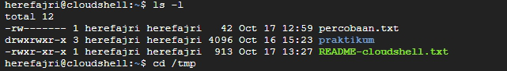

# Laporan Praktikum Minggu ke 3
Topik:  Manajemen File dan Permission di Linux

---

## Identitas
- **Nama**  : Muhammad Fajri Abdullah 
- **NIM**   : 250202979
- **Kelas** : 1IKRB

---

## Tujuan
Tuliskan tujuan praktikum minggu ini.  
Contoh:  
> Tujuan utama dari praktikum ini adalah agar mahasiswa mampu mengoperasikan perintah Linux dasar dengan benar, memahami sistem izin (permission), dan mendokumentasikan hasilnya dalam format laporan Git. Setelah menyelesaikan tugas ini,diharapkan para mahasiswa mampu:

- Menggunakan perintah ls, pwd, cd, cat untuk navigasi file dan direktori.
- Menggunakan chmod dan chown untuk manajemen hak akses file.
- Menjelaskan hasil output dari perintah Linux dasar.
- Menyusun laporan praktikum dengan struktur yang benar.
- Mengunggah dokumentasi hasil ke Git Repository tepat waktu.


---

## Dasar Teori
- Tuliskan ringkasan teori (3–5 poin) yang mendasari percobaan.
File permission adalah aturan yang menentukan siapa yang dapat membaca (read), menulis (write), atau mengeksekusi (execute) sebuah file atau direktori di sistem Linux. Setiap file atau direktori memiliki pengaturan izin yang dapat dikonfigurasi untuk pengguna tertentu.
- Secara default, Linux membagi pengguna menjadi tiga kategori:
 1. Owner (Pemilik) Pemilik file biasanya adalah pengguna yang membuat file tersebut.
 2. Group (Grup) Setiap file dapat dikaitkan dengan grup tertentu. Semua anggota grup ini dapat memiliki izin akses sesuai yang ditentukan.
 3. Others (Lainnya) Ini adalah semua pengguna lain di sistem yang bukan pemilik atau bagian dari grup terkait.
- Ada tiga jenis izin utama di Linux, yaitu:
 1. Read (r) Izin untuk membaca isi file atau melihat daftar isi direktori.
 2. Write (w) Izin untuk mengubah isi file atau menambahkan file ke dalam direktori.
 3. Execute (x) Izin untuk menjalankan file sebagai program atau script.

Sumber : Mengenal File Permission pada Linux Serta Contoh Penerapannya, Jetorbit, by Minz (https://www.jetorbit.com/panduan/mengenal-file-permission-pada-linux-serta-contoh-penerapannya/)

---

## Langkah Praktikum
1. Langkah-langkah yang dilakukan.  
2. Perintah yang dijalankan.  
3. File dan kode yang dibuat.  
4. Commit message yang digunakan.

---

## Kode / Perintah
Tuliskan potongan kode atau perintah utama:
**1. Eksperimen 1 – Navigasi Sistem File**
```bash
pwd
ls -l
cd /tmp
ls -a
```


~~

#pwd
```bash
herefajri@cloudshell:~$ pwd
/home/herefajri
```
**Penjelasan Hasil**
- `pwd` adalah singkatan dari "Print Working Directory".
-  Pada hasil I/O diatas bisa dilihat ada bagian `/home/herefajri` yang mana artinya posisi direktori sedang ada di directory home milik User `herefajri`.
~~

#ls -l
```bash
herefajri@cloudshell:~$ ls -l
total 12
-rw------- 1 herefajri herefajri   42 Oct 17 12:59 percobaan.txt
drwxrwxr-x 3 herefajri herefajri 4096 Oct 16 15:23 praktikum
-rwxr-xr-x 1 herefajri herefajri  913 Oct 17 13:27 README-cloudshell.txt
```
**Penjelasan Hasil**
- `total 12` Menunjukkan seluruh sis direktori seperti file dan folder menggunakan 12 blok disk.
- Pada `-rw------- 1 root herefajri 42 Oct 16 15:26 percobaan.txt` file ini hanya bisa diakses (baik dibaca maupun ditulis) oleh pemiliknya `root` grup dan orang lain tak punya akses sama sekali.
- Pada `drwxrwxr-x 3 herefajri herefajri 4096 Oct 16 15:23 praktikum` folder ini mempunyai akses penuh untuk pemilik dan grup, namum tidak untuk orang lainnya yang mana bukan bagian dari grup dan hanya bisa baca dan eksekusi.
- Pada `-rwxr-xr-x 1 herefajri herefajri 913 Oct 17 12:50 README-cloudshell.txt` yang mana titik utamanya pada `README-cloudshell.txt` yaitu file yang bisa dibaca oleh publik baik orang lain maupun grup, namun untuk menulis hanya pemilik yang mempunyai akses.
~~

#cd /tmp
 ```bash
herefajri@cloudshell:~$ cd /tmp
herefajri@cloudshell:/tmp$
```
**Penjelasan Hasil**
- Direktori aktif berpindah ke `/tmp` yang mana adalah direktori yang digunakan sistem dan aplikasi untuk menyimpan file dalam jangka waktu sementara.

~~

#ls -a
```bash
herefajri@cloudshell:/tmp$ ls -a
.                                                               tmp.0NHMVi75Dv  tmp.xVOCP68s0c              vscode-ipc-0a1eb557-8c8c-487e-84b8-ac3afcbf5a7e.sock
..                                                              tmp.1ivNYhsXLu  tmp.ZdoDgmEpap              vscode-ipc-4a55d0c1-bbf6-41ec-992e-353e57c89088.sock
code-oss-vm-session-state.json                                  tmp.2ySuu9UsQG  tmux-1000                   vscode-ipc-7239c235-0d16-43e8-80a2-49d69e5db462.sock
gemini-ide-server-38747.json                                    tmp.3qj6157Xs9  vscode-git-a3d1a5f5c9.sock  vscode-ipc-94740fdd-5fa5-4c62-bf08-2cc8ecb35d85.sock
gemini-ide-server-446.json                                      tmp.4QDQea0t1X  vscode-git-b69ec5b210.sock  vscode-ipc-fe411929-83f4-46e2-8a53-d0b91972634c.sock
minikube_delete_7d205c9ac03a60edf48a1c0a3ed3a4d118782338_0.log  tmp.HboOvNEZtn  vscode-git-e21923c9f4.sock  vscode-skaffold-events-logs
node-compile-cache                                              tmp.VM5vSF8YBB  vscode-git-f303b373af.sock  vscode-typescript1000
tmp                                                             tmp.vqyBRcQfRL  vscode-git-fe28e5148a.sock
```
**Penjelasan Hasil**
- `.` menunjukkan direktori saat ini dengan status tetap di `/home/herefajri/praktikum`.
- `..` menunjukkan direktori induk (satu tingkat diatas direktori saat ini) dengan status pindah dari `/home/herefajri/praktikum` ke `/home/herefajri`.
- Bagian-bagian seperti `tmp.0...... (dan selanjutnya)` (Status: File sementara yang dibuat oleh aplikasi) , `gemini-ide-server-3.... (dan selanjutnya)` (Status: File Konfigurasi dari server Gemini IDE) , dan `vscode-ip...... (dan selanjutnya)` (Status: File Socket yang dipakai oleh VSCode) adalah file sementara dan socket yang dipakai oleh aplikasi seperti Gemini IDE dan VSCode.
- `tmux-1000` adalah file runtime (file yang dibuat atau dipakai oleh suatu program disaat progam tersebut sedang berjalan dan biasanya berstatus sementara) yang dipakai oleh tmux (terminal multiplexer) yang dibuat di `/tmp` agar tmux bisa mengelola sesi terminal User
- `node-compile-cache` data yang disimpan oleh aplikasi setelah proses kompilasi (proses mengubah kode sumber menjadi kode mesin/bytecode) atau bisa disebut dengan cache hasil komplikasi (supaya tak perlu mengulangi proses yang sama setiap dijalankan) yang dijalankan oleh aplikasi Node.js

~~

**2. Eksperimen 2 – Membaca File**
```bash
cat /etc/passwd | head -n 5
```

#cat /etc/passwd | head -n 5
```bash
herefajri@cloudshell:/tmp$ cd
herefajri@cloudshell:~$ cat /etc/passwd | head -n 5
root:x:0:0:root:/root:/bin/bash
daemon:x:1:1:daemon:/usr/sbin:/usr/sbin/nologin
bin:x:2:2:bin:/bin:/usr/sbin/nologin
sys:x:3:3:sys:/dev:/usr/sbin/nologin
sync:x:4:65534:sync:/bin:/bin/sync
```
**Penjelasann isi file dan struktur barisnya (user, UID, GID, home, shell).**
- Tujuan perintah untuk menampilkan 5 baris pertama dari file `/etc/paswd` dimana berisi informasi terkait akun pengguna di Linux, yang mana biasa digunakan oleh sistem untuk proses login, menentukan direktori home, dan menetapkan shell default.
- Struktur barisnya
  | Nama Struktur Baris | Penjelasan |
  |---|---|
  | Username | Nama login User (example : `root` dan `daemon` bisa dilihat pada kode diatas) |
  | UID | User ID unik dengan `0` untuk memulai `root`|
  | GID | Group ID utama User yan dihubungkan ke `/etc/group` |
  | Home Directory (home_directory) | Direktori home User (kalau di Cloud contohnya `/root` dan `/home/herefajri`) |
  | Shell | SHell default yang digunakan User (contohnya seperti diatas `/bin/bash` dan `/usr/sbin/nologin`) |

~~

**3. Eksperimen 3**
```bash
echo "Hello <NAME><NIM>" > percobaan.txt
ls -l percobaan.txt
chmod 600 percobaan.txt
ls -l percobaan.txt
```
```bash
herefajri@cloudshell:~$ echo "Hello MUHAMMAD FAJRI ABDULLAH - 250202979" > percobaan.txt
herefajri@cloudshell:~$ ls -l percobaan.txt
-rw------- 1 herefajri herefajri 42 Oct 17 13:31 percobaan.txt
herefajri@cloudshell:~$ sudo chmod 600 percobaan.txt
herefajri@cloudshell:~$ ls -l percobaan.txt
-rw------- 1 herefajri herefajri 42 Oct 17 13:31 percobaan.txt
```
**Analisis perbedaan sebelum chmod dan sesudah chmod**
| Topik | Data Perbedaan yang tercantum dan Kesimpulannya |
|---|----|
| Sebelum `chmod` | `-rw-------` |
| Sesudah `chmod` | `-rw-------` |
| Kesimpulan | Tak ada perubahan yang terlihat dikarenakan permission awal atau izin awal sudah terdata `600` secara default. |

dan
```bash
sudo chown root percobaan.txt
ls -l percobaan.txt
```
```bash
herefajri@cloudshell:~$ sudo chown root percobaan.txt
herefajri@cloudshell:~$ ls -l percobaan.txt
-rw------- 1 root herefajri 42 Oct 17 13:31 percobaan.txt
herefajri@cloudshell:~$ 
```
**Analisis perbedaan sebelum chmod dan sesudah sudo chown root**
| Sebelum | Setelah |
|---|---|
| Status kepemilikan : `herefajri`  | Status kepemilikan : `root` |
| Group : `herefajri` | Group : `herefajri` |
| Hak akses : `-rw------- 1` | Hak akses : `-rw------- 1` |

Analisis menunjukkan bahwa perbedaan terbukti hanya ada pada status kepemilikan yang tadinya `User > Root`


Dimana jika User ingin bisa mendapatkan status kepemilikan kembali harus memberikan perintah 
```bash 
sudo chown <nama user> percobaan.txt
```

[Lihat hasil keseluruhan I/O dari Navigasi Sistem File, Membaca File, dan Permission & Ownership.txt](code/Keseluruhan.txt)

---

## Hasil Eksekusi
Sertakan screenshot hasil percobaan atau diagram:
1. Eksperimen 1 – Navigasi Sistem File





2. Eksperimen 2 – Membaca File


3. Eksperimen 3– Permission & Ownership


_**Bonus:**_


---

## Analisis
- Jelaskan makna hasil percobaan.  
- Hubungkan hasil dengan teori (fungsi kernel, system call, arsitektur OS).  
- Apa perbedaan hasil di lingkungan OS berbeda (Linux vs Windows)?  

## Analisis Hasil
Tugas
1. Dokumentasikan hasil seluruh perintah pada tabel observasi di laporan.md.
    **Jawaban:**

| No. | Perintah | Output | Penjelasan |
|---|----|---|---|
| 1. | `pwd` | [Output `pwd`](code/pwd.txt) |   |
| 2. | `ls -l` |  [Output `ls -l`](code/ls_-1.txt)  |   |
| 3. | `cd /tmp` | [Output `cd /tmp`](code/pwd.txt) |   |
| 4. | `ls -a` |   |   |
| 5. | `cd` |   |   |
| 6. | `cat /etc/passwd \| head -n 5` |   |   |
| 7. | `echo "Hello MUHAMMAD FAJRI ABDULLAH - 250202979" > percobaan.txt` |   |   |
| 8. | `ls -l percobaan.txt` |   |   |
| 9. | `sudo chmod 600 percobaan.txt` |    |   |
| 10. | `ls -l percobaan.txt` |  |   |
| 11. | `sudo chown root percobaan.txt` |  |   |
| 12. | `ls -l percobaan.txt` |   |   |

3. Jelaskan fungsi tiap perintah dan arti kolom permission (rwxr-xr--).
    **Jawaban:** 


5. Analisis peran chmod dan chown dalam keamanan sistem Linux.
    **Jawaban:** 


7. Upload hasil dan laporan ke repositori Git sebelum deadline.
    **Jawaban:** 


---

## Kesimpulan
Tuliskan 2–3 poin kesimpulan dari praktikum ini.

---

## Quiz
1. Tuliskan jawaban di bagian Quiz pada laporan:
  **Jawaban:**  
2. Apa fungsi dari perintah chmod?
  **Jawaban:**  
3. Apa arti dari kode permission rwxr-xr--?
  **Jawaban:**  
4. Jelaskan perbedaan antara chown dan chmod.
  **Jawaban:**  

---

## Refleksi Diri
Tuliskan secara singkat:
- Apa bagian yang paling menantang minggu ini?  
- Bagaimana cara Anda mengatasinya?  

---

**Credit:**  
_Template laporan praktikum Sistem Operasi (SO-202501) – Universitas Putra Bangsa_
