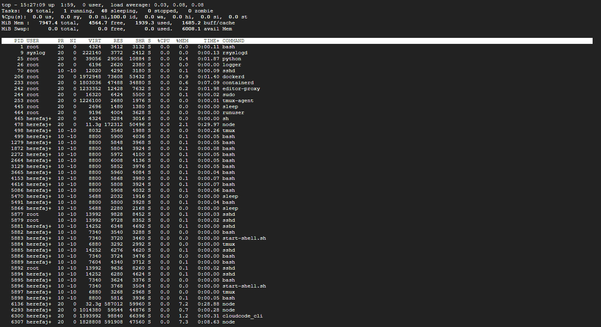

# Laporan Praktikum Minggu 4
Topik: Manajemen Proses dan User di Linux

---

## Identitas
- **Nama**  : Muhammad Fajri Abdullah 
- **NIM**   : 250202979
- **Kelas** : 1IKRB
---

## Tujuan
Tuliskan tujuan praktikum minggu ini.  
> Setelah menyelesaikan tugas ini,diharapkan mahasiswa mampu:

- Menjelaskan konsep proses dan user dalam sistem operasi Linux.
- Menampilkan daftar proses yang sedang berjalan dan statusnya.
- Menggunakan perintah untuk membuat dan mengelola user.
- Menghentikan atau mengontrol proses tertentu menggunakan PID.
- Menjelaskan kaitan antara manajemen user dan keamanan sistem.

---

## Dasar Teori
Tuliskan ringkasan teori (3–5 poin) yang mendasari percobaan.

1. Perintah ps dapat digunakan untuk menunjukkan semua proses yang sedang berjalan
pada mesin (bukan hanya proses pada shell saat ini) dengan format :
 - `ps–fae` atau
 - `ps-aux`
  
2. Beberapa versi UNIX mempunyai utilitas sistem yang disebut top yang menyediakan
cara interaktif untuk memonitor aktifitas sistem. Statistik secara detail dengan proses yang
berjalan ditampilkan dan secara terus-menerus di-refresh . Proses
ditampilkan secara terurut dari utilitas CPU. Kunci yang berguna pada top adalah
 - s– set update frequency
 - u– display proses dari satu user
 - k– kill proses (dengan PID)
 - q– qui

3.  Utilitas untuk melakukan pengontrolan proses dapat ditemukan pada sistem UNIX
adalah perintah `killall`. Perintah ini akan menghentikan proses sesuai PID atau job number
proses

 Sumber:
 - Modul Praktikum Sistem Operasi – Universitas Sebelas Maret (UNS),  Proses dan Manajemen Proses (https://spada.uns.ac.id/pluginfile.php/880150/mod_resource/content/1/Modul%206%20-%20Proses%20dan%20Manajemen%20Proses.pdf)
---

## Langkah Praktikum

   1. **Setup Environment**
   - Gunakan Linux (Ubuntu/WSL).  
   - Pastikan Anda sudah login sebagai user non-root.  
   - Siapkan folder kerja:
     ```
     praktikum/week4-proses-user/
     ```

   2. **Eksperimen 1 – Identitas User**
   Jalankan perintah berikut:
   ```bash
   whoami
   id
   groups
   ```
   - Jelaskan setiap output dan fungsinya.  
   - Buat user baru (jika memiliki izin sudo):
     ```bash
     sudo adduser praktikan
     sudo passwd praktikan
     ```
   - Uji login ke user baru.

   3. **Eksperimen 2 – Monitoring Proses**
   Jalankan:
   ```bash
   ps aux | head -10
   top -n 1
   ```
   - Jelaskan kolom penting seperti PID, USER, %CPU, %MEM, COMMAND.  
   - Simpan tangkapan layar `top` ke:
     ```
     praktikum/week4-proses-user/screenshots/top.png
     ```

   4. **Eksperimen 3 – Kontrol Proses**
   - Jalankan program latar belakang:
     ```bash
     sleep 1000 &
     ps aux | grep sleep
     ```
   - Catat PID proses `sleep`.  
   - Hentikan proses:
     ```bash
     kill <PID>
     ```
   - Pastikan proses telah berhenti dengan `ps aux | grep sleep`.

   5. **Eksperimen 4 – Analisis Hierarki Proses**
   Jalankan:
   ```bash
   pstree -p | head -20
   ```
   - Amati hierarki proses dan identifikasi proses induk (`init`/`systemd`).  
   - Catat hasilnya dalam laporan.

   6. **Commit & Push**
   ```bash
   git add .
   git commit -m "Minggu 4 - Manajemen Proses & User"
   git push origin main
   ```

---

## Kode / Perintah
Tuliskan potongan kode atau perintah utama:
```bash
   whoami
   id
   groups
   ```
  ```bash
  sudo adduser praktikan
  sudo passwd praktikan
  ```
  ```bash
  ps aux | head -10
  top -n 1
  ```
  ```bash
  sleep 1000 &
  ps aux | grep sleep
  ```
  ```bash
  kill <PID>
  ```
  ```bash
  pstree -p | head -20
  ```

---

## Hasil Eksekusi
Sertakan screenshot hasil percobaan atau diagram:



.png)

---

## Analisis

1. **Eksperimen 1 – Identitas User**

| Perintah | Hasil Output | Output | Fungsi |
|---|---|---|---|
| `whoami` | `bung_fajri024
` | Menampilkan nama User yang berstatus sedang aktif di terminal. | Memastikan pengguna sedang login sebagai siapa. |
| `id` | `uid=1000(bung_fajri024) gid=1000(bung_fajri024) groups=1000(bung_fajri024),4(adm),20(dialout),24(cdrom),25(floppy),27(sudo),29(audio),30(dip),44(video),46(plugdev),100(users),107(netdev)
` | Menampilkan UID (User ID), GID (Group ID), dan daftar grup yang dimiliki User. | Menunjukkan identitas sistem dari User. |
| `groups` | `bung_fajri024 adm dialout cdrom floppy sudo audio dip video plugdev users netdev
` | Menampilkan nama-nama grup yang diikuti oleh User aktif | Menentukan hak akses User terhadap file, folder, dan perintah khusus atau tertentu. |

2. **Eksperimen 2 – Monitoring Proses**
Dari kolom perintah `ps aux | head -10` dan `top -n 1`

| Kolom | Penjelasan |
|---|---|
| USER | Nama User yang menjalankan proses tersebut. Bisa `root`, User biasa, atau sistem.  |
| PID | (Singkatan dari: Process ID) Nomor unik yang diberikan oleh sistem untuk setiap proses. |
| %CPU | Persentase penggunaan CPU oleh proses tersebut. |
| %MEM | Persentase penggunaan memori fisik (RAM) oleh proses. |
| VSZ | (Singkatan dari: Virtual Memory Size) Total memori virtual yang digunakan proses (dalam KB). |
| RSS | (Singkatan dari: Resident Set Size) Jumlah memori fisik (RAM) yang digunakan proses (dalam KB). |
| TTY | Terminal yang terkait dengan proses |
| STAT | Status proses |
| COMMAND | Perintah yang dijalankan oleh proses |

3. **Eksperimen 3 – Kontrol Proses**

[W4](code/W4.txt) Belum di crop 


4. **Eksperimen 4 – Analisis Hierarki Proses**

Perintah : `pstree -p | head -20`


---

## Analisis Tugas

1. Gambar hierarki proses dalam bentuk diagram pohon (`pstree`).  
2. Penjelasan hubungan antara user management dan keamanan sistem Linux.  


---

## Kesimpulan
Tuliskan 2–3 poin kesimpulan dari praktikum ini.

---

## Quiz
Tuliskan jawaban di bagian **Quiz** pada laporan:
1. Apa fungsi dari proses `init` atau `systemd` dalam sistem Linux?   
   **Jawaban:**  
2. Apa perbedaan antara `kill` dan `killall`?  
   **Jawaban:**  
3. Mengapa user `root` memiliki hak istimewa di sistem Linux?  
   **Jawaban:**  

---

## Refleksi Diri
Tuliskan secara singkat:
- Apa bagian yang paling menantang minggu ini?  
- Bagaimana cara Anda mengatasinya?  

---

**Credit:**  
_Template laporan praktikum Sistem Operasi (SO-202501) – Universitas Putra Bangsa_
