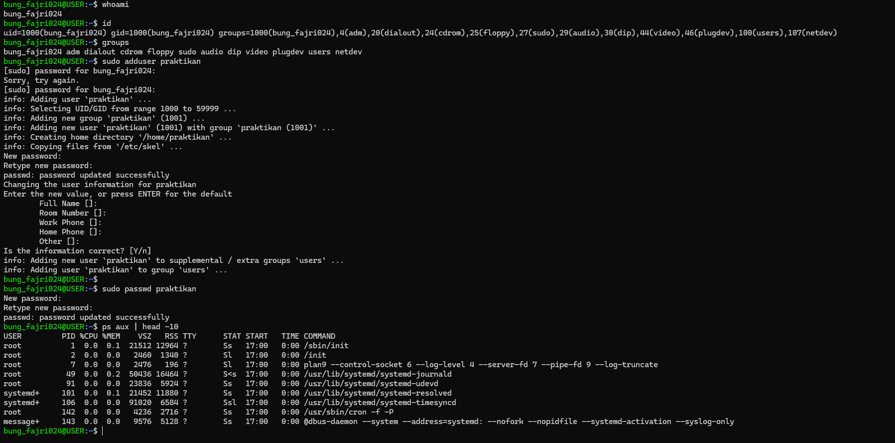
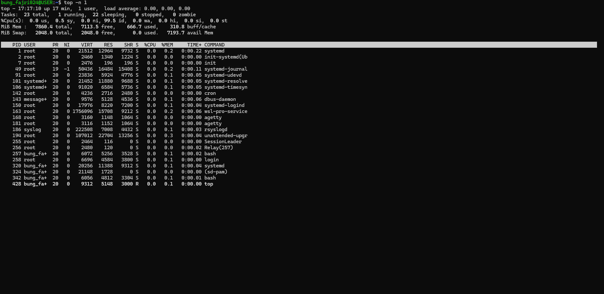

# Laporan Praktikum Minggu 4
Topik: Manajemen Proses dan User di Linux

---

## Identitas
- **Nama**  : Muhammad Fajri Abdullah 
- **NIM**   : 250202979
- **Kelas** : 1IKRB
---

## Tujuan
Tuliskan tujuan praktikum minggu ini.  
> Setelah menyelesaikan tugas ini,diharapkan mahasiswa mampu:

- Menjelaskan konsep proses dan user dalam sistem operasi Linux.
- Menampilkan daftar proses yang sedang berjalan dan statusnya.
- Menggunakan perintah untuk membuat dan mengelola user.
- Menghentikan atau mengontrol proses tertentu menggunakan PID.
- Menjelaskan kaitan antara manajemen user dan keamanan sistem.

---

## Dasar Teori
1. Kernel memelihara tabel dinamis dari semua driver yang diketahui dan menyediakan serangkaian rutin fungsi untuk memungkinkan menambahkan atau dihapus dari tabel ini kapan saja. Kernel memastikan bahwa ia memanggil Model's Startup Routine ketika modul tersebut dimuat dan memanggil Model's Cleanup Routine sebelum modul tersebut dibongkar. Rutinitas ini bertanggung jawab untuk mendaftarkan fungsionalitas modul.
2. Sebuah modul dapat mendaftarkan banyak jenis fungsionalitas, tidak terbatas pada satu jenis saja. Misalnya, driver perangkat mungkin ingin mendaftarkan mekanisme terpisah untuk mengakses perangkat. Tabel registrasi mencakup antara lain, item-item berikut:
• Driver perangkat (Driver ini mencakup perangkat karakter (seperti printer, terminal, dan mouse), perangkat blok (termasuk semua disk drive), dan
perangkat antarmuka jaringan).
• Sistem berkas (Sistem berkas dapat berupa apa pun yang mengimplementasikan pemanggilan rutin sistem berkas virtual Linux. Modul ini mungkin mengimplementasikan format untuk menyimpan berkas pada disk, tetapi bisa juga berupa sistem berkas jaringan, seperti NFS, atau sistem berkas virtual yang isinya dibuat sesuai permintaan, seperti sistem berkas `/proc` di Linux).
• Protokol jaringan (Sebuah modul dapat mengimplementasikan seluruh protokol jaringan seperti TCP, atau sekadar seperangkat aturan penyaringan paket baru untuk firewall jaringan).
• Format biner (Format ini menentukan cara mengenali, memuat, dan mengeksekusi jenis berkas eksekusi baru).
3. Dalam Manajemen Proses, sebuah proses merupakan konteks dasar di mana seluruh aktivitas yang di minta User dilayani dalam OS, dan agar kompatibel dengan sistem UNIX lain, Linux harus menggunakan proses model yang serupa dengan versi UNIX lain tersebut.
 

Sumber Materi : Operating System Concepts (Silberschatz et al., 2018)
atau bisa akses link berikut (https://lib.zu.edu.pk/ebookdata/Engineering/Cyber%20Security/Operating%20System%20Concepts-Wiley%20Global%20Education%20(2018)%20BY%20Abraham%20Silberschatz_%20Greg%20Gagne_%20Peter%20B.%20Galvin%20-.pdf)

---

## Langkah Praktikum

   1. **Setup Environment**
   - Gunakan Linux (Ubuntu/WSL).  
   - Pastikan Anda sudah login sebagai user non-root.  
   - Siapkan folder kerja:
     ```
     praktikum/week4-proses-user/
     ```

   2. **Eksperimen 1 – Identitas User**
   Jalankan perintah berikut:
   ```bash
   whoami
   id
   groups
   ```
   - Jelaskan setiap output dan fungsinya.  
   - Buat user baru (jika memiliki izin sudo):
     ```bash
     sudo adduser praktikan
     sudo passwd praktikan
     ```
   - Uji login ke user baru.

   3. **Eksperimen 2 – Monitoring Proses**
   Jalankan:
   ```bash
   ps aux | head -10
   top -n 1
   ```
   - Jelaskan kolom penting seperti PID, USER, %CPU, %MEM, COMMAND.  
   - Simpan tangkapan layar `top` ke:
     ```
     praktikum/week4-proses-user/screenshots/top.png
     ```

   4. **Eksperimen 3 – Kontrol Proses**
   - Jalankan program latar belakang:
     ```bash
     sleep 1000 &
     ps aux | grep sleep
     ```
   - Catat PID proses `sleep`.  
   - Hentikan proses:
     ```bash
     kill <PID>
     ```
   - Pastikan proses telah berhenti dengan `ps aux | grep sleep`.

   5. **Eksperimen 4 – Analisis Hierarki Proses**
   Jalankan:
   ```bash
   pstree -p | head -20
   ```
   - Amati hierarki proses dan identifikasi proses induk (`init`/`systemd`).  
   - Catat hasilnya dalam laporan.

   6. **Commit & Push**
   ```bash
   git add .
   git commit -m "Minggu 4 - Manajemen Proses & User"
   git push origin main
   ```

---

## Kode / Perintah
Tuliskan potongan kode atau perintah utama:
```bash
   whoami
   id
   groups
   ```
  ```bash
  sudo adduser praktikan
  sudo passwd praktikan
  ```
  ```bash
  ps aux | head -10
  top -n 1
  ```
  ```bash
  sleep 1000 &
  ps aux | grep sleep
  ```
  ```bash
  kill <PID>
  ```
  ```bash
  pstree -p | head -20
  ```

---

## Hasil Eksekusi
Sertakan screenshot hasil percobaan atau diagram:



.png)

---

## Analisis

1. **Eksperimen 1 – Identitas User**

| Perintah | Hasil Output | Output | Fungsi |
|----------|--------------|--------|--------|
| `whoami` | `bung_fajri024
` | Menampilkan nama User yang berstatus sedang aktif di terminal. | Memastikan pengguna sedang login sebagai siapa. |
| `id` | `uid=1000(bung_fajri024) gid=1000(bung_fajri024) groups=1000(bung_fajri024),4(adm),...` (disingkat)| Menampilkan UID (User ID), GID (Group ID), dan daftar grup yang dimiliki User. | Menunjukkan identitas sistem dari User. |
| `groups` | `bung_fajri024 adm dialout cdrom floppy sudo audio...` (disingkat)
` | Menampilkan nama-nama grup yang diikuti oleh User aktif | Menentukan hak akses User terhadap file, folder, dan perintah khusus atau tertentu. |

Perhatian : Adanya variable `(disingkat)` pada kolom Hasil Output menunjukkan bahwa kalimat (hasil output perintah) terlalu panjang hingga bisa menyebabkan bentuk tabel yang kacau.
Untuk bukti bisa dilihat pada ***Hasil EKsekusi*** diatas.

2. **Eksperimen 2 – Monitoring Proses**
Dari kolom perintah `ps aux | head -10` dan `top -n 1`

| Kolom | Penjelasan |
|---|---|
| USER | Nama User yang menjalankan proses tersebut. Bisa `root`, User biasa, atau sistem.  |
| PID | (Singkatan dari: Process ID) Nomor unik yang diberikan oleh sistem untuk setiap proses. |
| %CPU | Persentase penggunaan CPU oleh proses tersebut. |
| %MEM | Persentase penggunaan memori fisik (RAM) oleh proses. |
| COMMAND | Perintah yang dijalankan oleh proses |

3. **Eksperimen 3 – Kontrol Proses**

`bung_fajri024@USER:~$ sleep 1000 &
[1] 429`
Dimana PID (Process ID) adalah angka `429`.


4. **Eksperimen 4 – Analisis Hierarki Proses**

| Nama Perintah | Fungsi | Tujuan | Hasil | Penjelasan |
|---|---|---|---|---|
| `pstree -p \| head -20` | Menampilkan struktr hierark proses dalam bentuk pohon dan membatasi output ke 20 baris pertama | Mengidentifikasi proses induk yang menjadi akar dari seluruh proses lain di sistem | [Hasil bisa dilihat pada Analisis Tugas] atau klik ini [Hasil pstree](code/pstree-p_head-20.txt)| `systemd` sendiri adalah init system modern yang mana semua proses layaknya shell (bash), dbus-daemon, dan sebagainya adalah anak dari `systemd` |


---

## Analisis Tugas

1. Gambar hierarki proses dalam bentuk diagram pohon (`pstree`).
    **Jawaban:**  
```bash
systemd(1)-+-agetty(168)
           |-agetty(181)
           |-cron(142)
           |-dbus-daemon(143)
           |-init-systemd(Ub(2)-+-SessionLeader(255)---Relay(257)(256)---bash(257)-+-head(435)
           |                    |                                                  `-pstree(434)
           |                    |-init(7)---{init}(8)
           |                    |-login(258)---bash(342)
           |                    `-{init-systemd(Ub}(9)
           |-rsyslogd(186)-+-{rsyslogd}(220)
           |               |-{rsyslogd}(221)
           |               `-{rsyslogd}(222)
           |-systemd(320)---(sd-pam)(324)
           |-systemd-journal(49)
           |-systemd-logind(150)
           |-systemd-resolve(101)
           |-systemd-timesyn(106)---{systemd-timesyn}(140)
           |-systemd-udevd(91)
           |-unattended-upgr(194)---{unattended-upgr}(225)
           `-wsl-pro-service(163)-+-{wsl-pro-service}(197)
```

2. Penjelasan hubungan antara user management dan keamanan sistem Linux.
    **Jawaban:**
  User Management di Linux erat kaitannya dengan keamanan system
- Isolasi Akses, dimana setiap user memiliki UID dan GID yang membatasi akses terhadap file, proses, dan perangkat. Ini mencegah User Biasa mengakses data milik User Lain atau Sytem.
- Group dan Hak Istimewa, dimana User bisa tergabung dalam grup seperti `sudo`, `adm`, atau lainnya.
- User Root, yang mana merupakan Super User dengan akses penuh ke system, namum dibatasi penggunaannya agar mencegah perubahan system yang tak disengaja atau berbahaya.
- Keamanan Proses, proses yang dijalankan oleh User hanya bisa dimodifikasi atau dihentikan oleh User itu sendiri untuk mencegah manipulasi proses antar-user.


---

## Kesimpulan

Kesimpulan dari praktikum ini.
- Melalui praktikum ini, mahasiswa bisa mengenal tentang sistem Linux mengelola proses dan User, termasuk juga UID, Hak akses, dan sebagainya.
- Mahasiswa dapat memantau, emgontrol, dan menganalisis proses yang berjalan di sistem melalui beberapa perintah yang teah disediakan dan memahami peran penting proses induk yang diaplikasikanj dalam praktikum ini `systemd`.
- Mempelajari hubungan antara User Management dengan keamanan sistem.


---

## Quiz
Tuliskan jawaban di bagian **Quiz** pada laporan:
1. Apa fungsi dari proses `init` atau `systemd` dalam sistem Linux?   
   **Jawaban:**
    `init` atau `systemd` memiliki fungsi untuk menginisialiasi system, memulai semua layanan daemon, dan menjadi induk dari proses lain.
3. Apa perbedaan antara `kill` dan `killall`?  
   **Jawaban:**
   - `kill` digunakan untuk menghentikan proses berdasarkan PID tertentu.
   - `killall` digunakan untuk menghentikan semua proses yang memiliki nama program tertentu.
5. Mengapa user `root` memiliki hak istimewa di sistem Linux?  
   **Jawaban:**
   User `root` yang mana merupakan Super User dengan akses penuh ke seluruh system, yang memungkinkan `root` mrngubah konfigurasi sistem, mengakses semua file, menjalankan perintah administratif, dan mengelola User lain.

---

## Refleksi Diri
Tuliskan secara singkat:
- Apa bagian yang paling menantang minggu ini?  Menjalankan perintah yang mana tidak bisa memperoleh hasil yang ditentukan pada perintah `pstree -p | head -20
 terutama di Shell Cloud Google dan kegagalan berulang kali melawan mode `root` pada Linux.
- Bagaimana cara Anda mengatasinya? Menjalankannya di device yang berbeda, menggunakan device universitas sebagai alat pengganti device sebelumnya dikarenakan kekhawatiran akan keamanan device pribadi. Pemecahan masalah terkait mode `root` diselesaikan dengan lebih dari 3 kali percobaan yang gagal dan konsultasi dengan teman.

---

**Credit:**  
_Template laporan praktikum Sistem Operasi (SO-202501) – Universitas Putra Bangsa_
