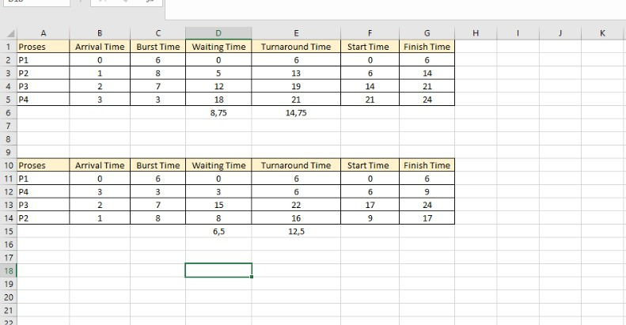

# Laporan Praktikum Minggu 5
Topik: Penjadwalan CPU – FCFS dan SJF

---

## Identitas
- **Nama**  : Muhammad Fajri Abdullah 
- **NIM**   : 250202979
- **Kelas** : 1IKRB

---

## Tujuan  

Setelah menyelesaikan tugas ini, mahasiswa mampu:
1. Menghitung waiting time dan turnaround time untuk algoritma FCFS dan SJF.
2. Menyajikan hasil perhitungan dalam tabel yang rapi dan mudah dibaca.
3. Membandingkan performa FCFS dan SJF berdasarkan hasil analisis.
4. Menjelaskan kelebihan dan kekurangan masing-masing algoritma.
5. Menyimpulkan kapan algoritma FCFS atau SJF lebih sesuai digunakan.
   
---

## Dasar Teori

**1. First-Come, First-Served (FCFS)** 
FCFS adalah algoritma penjadwalan paling sederhana, di mana proses dieksekusi berdasarkan urutan kedatangan. Proses yang datang lebih dulu akan dijalankan lebih dulu.
- Kelebihan: Mudah diimplementasikan dan dipahami.
- Kekurangan: Dapat menyebabkan convoy effect, yaitu proses pendek harus menunggu proses panjang selesai.

**2. Shortest Job First (SJF)**
SJF memilih proses dengan waktu eksekusi (burst time) terpendek. Algoritma ini dapat bersifat non-preemptive maupun preemptive.
- Kelebihan: Memberikan waktu tunggu rata-rata paling rendah secara teoritis.
- Kekurangan: Sulit diterapkan karena memerlukan prediksi burst time, dan dapat menyebabkan starvation bagi proses panjang.

**3. Turnaround Time dan Waiting Time**
- Turnaround Time adalah total waktu yang dibutuhkan proses sejak tiba hingga selesai.
- Waiting Time adalah waktu yang dihabiskan proses dalam antrian sebelum dieksekusi.

Sumber : Abraham Silberschatz, Peter Baer Galvin, Greg Gagne. Operating System Concepts, 10th Edition, Wiley, 2018.

---

## Langkah Praktikum

1. **Siapkan Data Proses**
   Gunakan tabel proses berikut sebagai contoh (boleh dimodifikasi dengan data baru):
   | Proses | Burst Time | Arrival Time |
   |:--:|:--:|:--:|
   | P1 | 6 | 0 |
   | P2 | 8 | 1 |
   | P3 | 7 | 2 |
   | P4 | 3 | 3 |

2. **Eksperimen 1 – FCFS (First Come First Served)**
   - Urutkan proses berdasarkan *Arrival Time*.  
   - Hitung nilai berikut untuk tiap proses:
     ```
     Waiting Time (WT) = waktu mulai eksekusi - Arrival Time
     Turnaround Time (TAT) = WT + Burst Time
     ```
   - Hitung rata-rata Waiting Time dan Turnaround Time.  
   - Buat Gantt Chart sederhana:  
     ```
     | P1 | P2 | P3 | P4 |
     0    6    14   21   24
     ```

3. **Eksperimen 2 – SJF (Shortest Job First)**
   - Urutkan proses berdasarkan *Burst Time* terpendek (dengan memperhatikan waktu kedatangan).  
   - Lakukan perhitungan WT dan TAT seperti langkah sebelumnya.  
   - Bandingkan hasil FCFS dan SJF pada tabel berikut:

     | Algoritma | Avg Waiting Time | Avg Turnaround Time | Kelebihan | Kekurangan |
     |------------|------------------|----------------------|------------|-------------|
     | FCFS | ... | ... | Sederhana dan mudah diterapkan | Tidak efisien untuk proses panjang |
     | SJF | ... | ... | Optimal untuk job pendek | Menyebabkan *starvation* pada job panjang |

4. **Eksperimen 3 – Visualisasi Spreadsheet (Opsional)**
   - Gunakan Excel/Google Sheets untuk membuat perhitungan otomatis:
     - Kolom: Arrival, Burst, Start, Waiting, Turnaround, Finish.
     - Gunakan formula dasar penjumlahan/subtraksi.
   - Screenshot hasil perhitungan dan simpan di:
     ```
     praktikum/week5-scheduling-fcfs-sjf/screenshots/
     ```

5. **Analisis**
   - Bandingkan hasil rata-rata WT dan TAT antara FCFS & SJF.  
   - Jelaskan kondisi kapan SJF lebih unggul dari FCFS dan sebaliknya.  
   - Tambahkan kesimpulan singkat di akhir laporan.

6. **Commit & Push**
   ```bash
   git add .
   git commit -m "Minggu 5 - CPU Scheduling FCFS & SJF"
   git push origin main
   ```

---

## Hasil Eksekusi
Sertakan screenshot hasil percobaan atau diagram:


---

## Analisis

---

## Kesimpulan
Tuliskan 2–3 poin kesimpulan dari praktikum ini.

---

## Quiz
1. Apa perbedaan utama antara FCFS dan SJF?
   **Jawaban:**
   
2. Mengapa SJF dapat menghasilkan rata-rata waktu tunggu minimum?
   **Jawaban:**
   
3. Apa kelemahan SJF jika diterapkan pada sistem interaktif?
   **Jawaban:**  


---

## Refleksi Diri
Tuliskan secara singkat:
- Apa bagian yang paling menantang minggu ini?  
- Bagaimana cara Anda mengatasinya?  

---

**Credit:**  
_Template laporan praktikum Sistem Operasi (SO-202501) – Universitas Putra Bangsa_
