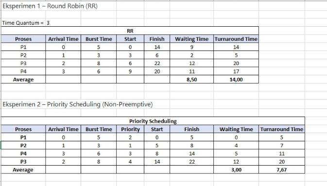
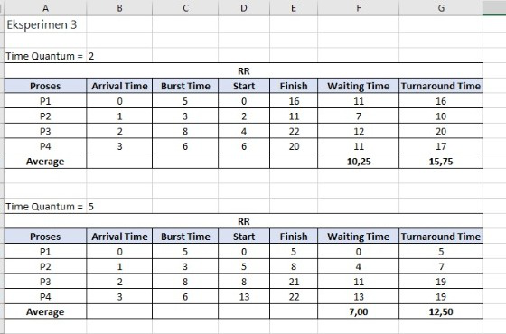

# Laporan Praktikum Minggu 6
Topik: Penjadwalan CPU – Round Robin (RR) dan Priority Scheduling

---

## Identitas
- **Nama**  : Muhammad Fajri Abdullah 
- **NIM**   : 250202979
- **Kelas** : 1IKRB

---

## Tujuan
Diharapkan setelah menyelesaikan sesi praktikum ini, mahasiswa dapat :
- Menghitung waiting time (WT) dan turnaround time (TAT) pada algoritma RR dan Priority.
- Menyusun tabel "hasil perhitungan" dengan benar dan sistematis.
- Membandingkan performa algoritma antara RR dan Priority.
- Menjelaskan pengaruh time quantum dan prioritas terhadap keadilan eksekusi proses.
- Menarik kesimpulan mengenai efisiensi dan keadilan dari kedua algoritma tersebut.

---

## Dasar Teori
1. Penjadwalan Round-Robin (RR) dirancang khusus untuk sistem time-sharing. Algoritma ini mirip dengan penjadwalan First-Come, First-Served (FCFS), namun dengan penambahan preemption agar proses dapat bergantian. Unit waktu kecil yang disebut time quantum atau time slice ditentukan. Antrian proses siap diperlakukan sebagai antrian melingkar. Penjadwal CPU akan berputar mengalokasikan CPU ke setiap proses selama interval waktu maksimal satu time quantum. Jika proses belum selesai dalam waktu tersebut, maka proses akan dipreempt dan ditempatkan di akhir antrian.
2. Penjadwalan prioritas dimana setiap proses diberi nilai prioritas, dan CPU dialokasikan ke proses dengan prioritas tertinggi (angka kecil = prioritas tinggi). Jika dua proses memiliki prioritas yang sama, maka dijadwalkan berdasarkan urutan kedatangan (FCFS). Algoritma Shortest Job First (SJF) merupakan bentuk khusus dari penjadwalan prioritas, di mana prioritas ditentukan berdasarkan kebalikan dari prediksi burst time berikutnya. Penjadwalan prioritas dapat bersifat preemptive maupun non-preemptive. Masalah utama dari algoritma ini adalah kemungkinan terjadinya starvation atau kelaparan proses dengan prioritas rendah. Solusi untuk masalah ini adalah dengan menerapkan aging.
3. Waktu tunggu (Waiting Time) adalah total waktu yang dihabiskan proses dalam antrian siap. Turnaround time adalah total waktu dari saat proses dikirimkan hingga selesai dieksekusi. Kedua metrik ini digunakan untuk mengevaluasi performa algoritma penjadwalan.
4. Penjadwalan RR cenderung adil karena setiap proses mendapatkan jatah waktu CPU yang sama. Namun, jika time quantum terlalu besar, algoritma ini akan menyerupai FCFS; jika terlalu kecil, akan terjadi terlalu banyak context switching. Penjadwalan prioritas efisien untuk proses-proses penting, tetapi berisiko menyebabkan starvation pada proses dengan prioritas rendah jika tidak diimbangi dengan mekanisme aging.

Sumber Materi : Abraham Silberschatz, Peter Baer Galvin, Greg Gagne. Operating System Concepts, 10th Edition, Wiley, 2018.

---

## Langkah Praktikum
1. Siapkan Data Proses dengan menggunakan contoh data dibawah ini dan boleh dimodifikasi sesuai kebutuhan:
   | Proses | Burst Time | Arrival Time | Priority |
   |:--:|:--:|:--:|:--:|
   | P1 | 5 | 0 | 2 |
   | P2 | 3 | 1 | 1 |
   | P3 | 8 | 2 | 4 |
   | P4 | 6 | 3 | 3 |

2. Untuk Eksperimen 1 – tentang Round Robin (RR), ikuti instruksi dibawah ini:
   - Gunakan *time quantum (q)* = 3.  
   - Hitung *waiting time* dan *turnaround time* untuk tiap proses.  
   - Simulasikan eksekusi menggunakan Gantt Chart (manual atau spreadsheet).  
     ```
     | P1 | P2 | P3 | P4 | P1 | P3 | ...
     0    3    6    9   12   15   18  ...
     ```
   - Tugas : Catat sisa *burst time* tiap putaran.

3. Untuk Eksperimen 2 – tentang Priority Scheduling (Non-Preemptive), ikuti instruksi dibawah ini:
   - Urutkan proses berdasarkan nilai prioritas (angka kecil = prioritas tinggi) dan lakukan perhitungan manual untuk:
     ```
     WT[i] = waktu mulai eksekusi - Arrival[i]
     TAT[i] = WT[i] + Burst[i]
     ```
   - Tugas : Buat tabel perbandingan hasil RR dan Priority.

4.  Untuk Eksperimen 3 – tentang Analisis Variasi Time Quantum (Opsional), ikuti instruksi dibawah ini:
   - Ubah *quantum* menjadi 2 dan 5.  
   - Amati perubahan nilai rata-rata *waiting time* dan *turnaround time*.  
   - Tugas : Buat tabel perbandingan efek *quantum*.

5. Untuk Eksperimen 4 – terkait dengan dokumentasi. Simpan semua hasil tabel dan screenshot ke:
     ```
     praktikum/week6-scheduling-rr-priority/screenshots/
     ```
   dan tambahan, Tugas : Buat tabel perbandingan seperti berikut:

     | Algoritma | Avg Waiting Time | Avg Turnaround Time | Kelebihan | Kekurangan |
     |------------|------------------|----------------------|------------|-------------|
     | RR | ... | ... | Adil terhadap semua proses | Tidak efisien jika quantum tidak tepat |
     | Priority | ... | ... | Efisien untuk proses penting | Potensi *starvation* pada prioritas rendah |

6. **Commit & Push**
   ```bash
   git add .
   git commit -m "Minggu 6 - CPU Scheduling RR & Priority"
   git push origin main
   ```

---

## Hasil Eksekusi
Sertakan screenshot hasil percobaan atau diagram:



---

## Analisis
| Proses | Burst Time | Arrival Time | Priority |
   |:--:|:--:|:--:|:--:|
   | P1 | 5 | 0 | 2 |
   | P2 | 3 | 1 | 1 |
   | P3 | 8 | 2 | 4 |
   | P4 | 6 | 3 | 3 |

**1. Eksperimen 1 – Round Robin (RR)**
	Time Quantum =3
	

```bash
| P1 | P2 | P3 | P4 | P1 | P3 | P4 | P3 |
0    3    6    9   12   14   17    20   22
 ```


| Putaran | Time Quantum | P1 | P2 | P3 | P4 |
|---|---|---|---|---|---|---|
| Ke-1 | 3 | BT=5 <br> Sisa = 2 | BT=0 <br> Sisa = 0 | BT=8 <br> Sisa = 5 | BT=6 <br> Sisa = 3 |
| Ke-2 | 3 | BT=2 <br> Sisa = 0 | BT=0 | BT=5 <br> Sisa = 2 | BT=3 <br> Sisa = 0 |
| Ke-3 | 3 | BT=0 | BT=0 | BT=2 <br> Sisa = 0 | BT=0 |

**2. Eksperimen 2 – Priority Scheduling (Non-Preemptive)**


```bash
| P1 | P2 | P4 | P3 | 
 0    5    8    14   22
```

	

**3. Eksperimen 3 – Analisis Variasi Time Quantum**
		


	- Time Quantum =2
  
    ```bash
      | P1 | P2 | P3 | P4 | P1 | P2 | P3 | P4 | P1 | P3 | P4 | P3 |
      0    2    4    6   8   10   11    13   15   16   18   20   22
    ```
	- Time Quantum =5

    ```bash
      | P1 | P2 | P3 | P4 | P3 | P4 | 
      0    5   8    13   18   21   22   
    ```

---

## Tugas
1. Hitung *waiting time* dan *turnaround time* untuk algoritma RR dan Priority.  
2. Sajikan hasil perhitungan dan Gantt Chart dalam `laporan.md`.  
3. Bandingkan performa dan jelaskan pengaruh *time quantum* serta prioritas.  
4. Simpan semua bukti (tabel, grafik, atau gambar) ke folder `screenshots/`.  
(Masih prototipe pengerjaan)

---

## Kesimpulan
Tuliskan 2–3 poin kesimpulan dari praktikum ini.

---

## Quiz
1. Apa perbedaan utama antara Round Robin dan Priority Scheduling?
   **Jawaban:**

   
2. Apa pengaruh besar/kecilnya *time quantum* terhadap performa sistem?
   **Jawaban:**

    
3. Mengapa algoritma Priority dapat menyebabkan *starvation*?  
   **Jawaban:**
   


---

## Refleksi Diri
Tuliskan secara singkat:
- Apa bagian yang paling menantang minggu ini?  
- Bagaimana cara Anda mengatasinya?  

---

**Credit:**  
_Template laporan praktikum Sistem Operasi (SO-202501) – Universitas Putra Bangsa_
