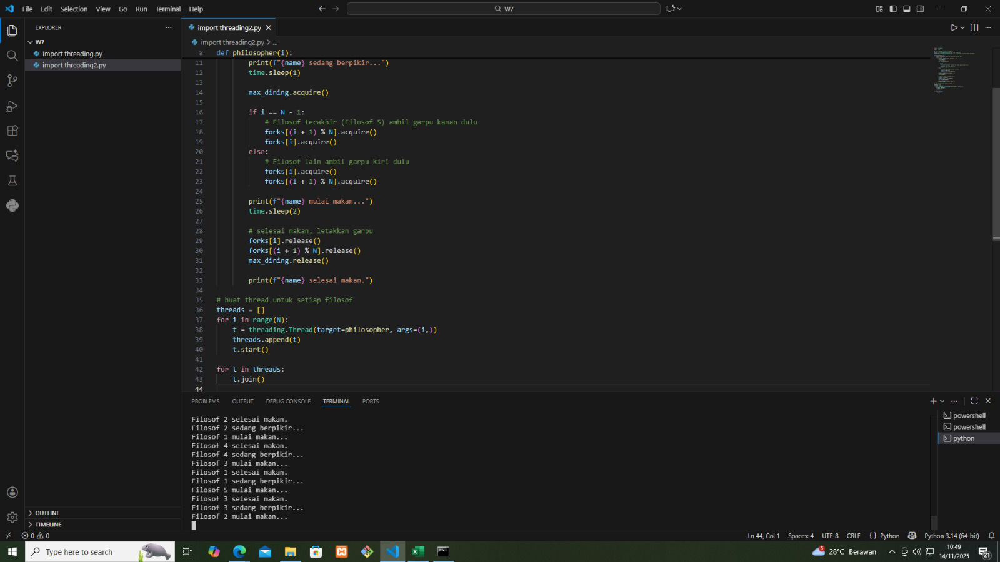
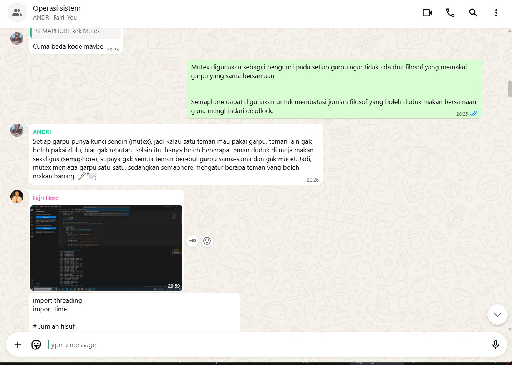

# Laporan Praktikum Minggu 7
Topik: Sinkronisasi Proses dan Masalah Deadlock

---

## Identitas
- **Nama**  : Muhammad Fajri Abdullah 
- **NIM**   : 250202979
- **Kelas** : 1IKRB
---

## Tujuan
Setelah menyelesaikan tugas ini, diharapkan mahasiswa mampu:
1. Mengidentifikasi empat kondisi penyebab deadlock (*mutual exclusion, hold and wait, no preemption, circular wait*).  
2. Menjelaskan mekanisme sinkronisasi menggunakan *semaphore* atau *monitor*.  
3. Menganalisis dan memberikan solusi untuk kasus deadlock.  
4. Berkolaborasi dalam tim untuk menyusun laporan analisis.  
5. Menyajikan hasil studi kasus secara sistematis.  

---

## Dasar Teori

-  Cooperating Process adalah proses yang dapat memengaruhi atau dipengaruhi oleh proses lain yang dijalankan dalam sistem. Cooperating Process dapat langsung berbagi ruang alamat logis (yaitu, baik kode maupun data) atau hanya diizinkan untuk berbagi data melalui memori bersama atau pertukaran pesan. Namun, akses bersamaan ke data bersama dapat mengakibatkan ketidakkonsistenan data.
-  Penggunaan Semaphore Sistem operasi sering membedakan antara semaphore penghitung dan semaphore biner. Nilai dari semaphore penghitung dapat berkisar dalam domain yang tidak terbatas. Nilai dari semaphore biner hanya dapat berkisar antara 0 dan 1. Dengan demikian, semaphore biner berperilaku mirip dengan kunci mutex. Bahkan, pada sistem yang tidak menyediakan kunci mutex, semaphore biner dapat digunakan sebagai pengganti untuk menyediakan eksklusi mutual.
-  Deadlock, implementasi semaphore dengan waiting queue (antrian tunggu) dapat menyebabkan situasi di mana dua atau lebih proses menunggu tanpa batas waktu untuk suatu kejadian yang hanya dapat disebabkan oleh salah satu dari proses yang sedang menunggu tersebut. Kejadian yang dimaksud adalah eksekusi operasi signal(). Ketika keadaan seperti ini terjadi, proses-proses tersebut dikatakan berada dalam kondisi deadlock (kebuntuan).
-  The Dining-Philosophers Problem, bayangkan ada lima orang filsuf yang menghabiskan hidup mereka dengan berpikir dan makan. Para filsuf itu duduk melingkar di sebuah meja bundar yang dikelilingi oleh lima kursi, masing-masing milik satu filsuf. Di tengah meja terdapat semangkuk nasi, dan di atas meja tersebut terdapat lima sumpit tunggal. Ketika seorang filsuf sedang berpikir, ia tidak berinteraksi dengan rekan-rekannya. Dari waktu ke waktu, seorang filsuf merasa lapar dan berusaha mengambil dua sumpit yang paling dekat dengannya (yaitu sumpit yang berada di antara dirinya dan tetangga di sisi kiri serta kanannya). Seorang filsuf hanya dapat mengambil satu sumpit dalam satu waktu. Jelas bahwa ia tidak dapat mengambil sumpit yang sudah dipegang oleh tetangganya. Ketika seorang filsuf yang lapar berhasil memegang kedua sumpit secara bersamaan, ia mulai makan tanpa melepaskan sumpit tersebut. Setelah selesai makan, ia meletakkan kembali kedua sumpit dan mulai berpikir lagi.

Sumber : Abraham Silberschatz, Peter Baer Galvin, Greg Gagne. Operating System Concepts, 10th Edition, Wiley, 2018.

---

## Langkah Praktikum
1. **Persiapan Tim**
   - Bentuk kelompok beranggotakan 3–4 orang.  
   - Tentukan ketua dan pembagian tugas (analisis, implementasi, dokumentasi).

2. **Eksperimen 1 – Simulasi Dining Philosophers (Deadlock Version)**
   - Implementasikan versi sederhana dari masalah *Dining Philosophers* tanpa mekanisme pencegahan deadlock.  
   - Contoh pseudocode:
     ```text
     while true:
       think()
       pick_left_fork()
       pick_right_fork()
       eat()
       put_left_fork()
       put_right_fork()
     ```
   - Jalankan simulasi atau analisis alur (boleh menggunakan pseudocode atau diagram alur).  
   - Identifikasi kapan dan mengapa deadlock terjadi.

3. **Eksperimen 2 – Versi Fixed (Menggunakan Semaphore / Monitor)**
   - Modifikasi pseudocode agar deadlock tidak terjadi, misalnya:
     - Menggunakan *semaphore (mutex)* untuk mengontrol akses.
     - Membatasi jumlah filosof yang dapat makan bersamaan (max 4).  
     - Mengatur urutan pengambilan garpu (misal, filosof terakhir mengambil secara terbalik).  
   - Analisis hasil modifikasi dan buktikan bahwa deadlock telah dihindari.

4. **Eksperimen 3 – Analisis Deadlock**
   - Jelaskan empat kondisi deadlock dari versi pertama dan bagaimana kondisi tersebut dipecahkan pada versi fixed.  
   - Sajikan hasil analisis dalam tabel seperti contoh berikut:

     | Kondisi Deadlock | Terjadi di Versi Deadlock | Solusi di Versi Fixed |
     |------------------|---------------------------|------------------------|
     | Mutual Exclusion | Ya (satu garpu hanya satu proses) | Gunakan semaphore untuk kontrol akses |
     | Hold and Wait | Ya | Hindari proses menahan lebih dari satu sumber daya |
     | No Preemption | Ya | Tidak ada mekanisme pelepasan paksa |
     | Circular Wait | Ya | Ubah urutan pengambilan sumber daya |

5. **Eksperimen 4 – Dokumentasi**
   - Simpan semua diagram, screenshot simulasi, dan hasil diskusi di:
     ```
     praktikum/week7-concurrency-deadlock/screenshots/
     ```
   - Tuliskan laporan kelompok di `laporan.md` (format IMRaD singkat: *Pendahuluan, Metode, Hasil, Analisis, Diskusi*).

6. **Commit & Push**
   ```bash
   git add .
   git commit -m "Minggu 7 - Sinkronisasi Proses & Deadlock"
   git push origin main
   ```

---

## Kode / Perintah
```bash
import threading
import time

N = 5  # jumlah filosof (1 sampai 5)
forks = [threading.Semaphore(1) for _ in range(N)]
max_dining = threading.Semaphore(N - 1)  # maksimal 4 filosof makan bersamaan

def philosopher(i):
    name = f"Filosof {i+1}"  # tampilkan Filosof 1–5
    while True:
        print(f"{name} sedang berpikir...")
        time.sleep(1)

        max_dining.acquire()

        if i == N - 1:
            # Filosof terakhir (Filosof 5) ambil garpu kanan dulu
            forks[(i + 1) % N].acquire()
            forks[i].acquire()
        else:
            # Filosof lain ambil garpu kiri dulu
            forks[i].acquire()
            forks[(i + 1) % N].acquire()

        print(f"{name} mulai makan...")
        time.sleep(2)

        # selesai makan, letakkan garpu
        forks[i].release()
        forks[(i + 1) % N].release()
        max_dining.release()

        print(f"{name} selesai makan.")

# buat thread untuk setiap filosof
threads = []
for i in range(N):
    t = threading.Thread(target=philosopher, args=(i,))
    threads.append(t)
    t.start()

for t in threads:
    t.join()
```

---

## Hasil Eksekusi




**Dokumentasi Kerja Team**


---

## Analisis & Tugas

**Status Kerangka Tim**
`
- Ketua : Andri Dwi Yuliyanto (250202976)
- Implementasi : Andri Dwi Yuliyanto (250202976)
- Analisis : Rafi Nurul Fauzan (250202961)
- Dokumentasi : Muhammad Fajri Abdullah (250202979)
`

1. **Eksperimen 1 – Simulasi Dining Philosophers (Deadlock Version)**

Pseudocode Deadlock Version

```pseudo
while true:
    think()
    pick_left_fork()
    pick_right_fork()
    eat()
    put_left_fork()
    put_right_fork()
```
**Analisis Deadlock**
Deadlock terjadi saat semua filosofi mengambil garpu kiri mereka tapi menunggu garpu kanan yang sedang dipegang filosof lain. Maka semua filosofi stuck saling menunggu garpu satu sama lain, tidak ada yang bisa makan, menyebabkan kondisi deadlock.

2. **Eksperimen 2 – Versi Fixed (Menggunakan Semaphore)**

Modifikasi Pseudocode

```pseudo
semaphore max_dining = 4

while true:
    think()
    wait(max_dining)           # Batasi max filosof yang makan bersamaan
    if id_filosof == N:        # Filosof terakhir mengambil garpu secara terbalik
        pick_right_fork()
        pick_left_fork()
    else:
        pick_left_fork()
        pick_right_fork()
    eat()
    put_left_fork()
    put_right_fork()
    signal(max_dining)
```

**Analisis hasil:**
- Maksimal 4 filosof makan bersamaan, cegah semuanya ambil garpu dan tunggu.
- Filosof terakhir ubah urutan pengambilan garpu, lalu hilangkan circular wait.
- Dengan semaphore, mutual exclusion tetap terjaga.
- Deadlock tidak terjadi karena semua empat kondisi deadlock dicegah.


3. **Eksperimen 3 – Analisis Deadlock dalam Tabel**

| Kondisi Deadlock     | Terjadi di Versi Deadlock | Solusi di Versi Fixed  |
|---|---|---|
| Mutual Exclusion | Ya | Gunakan semaphore untuk mengontrol akses garpu |
| Hold and Wait | Ya | Batasi jumlah filosof yang makan bersamaan (semaphore max_dining) |
| No Preemption | Ya | Filosof melepaskan garpu secara sukarela setelah makan |
| Circular Wait | Ya | Filosof terakhir mengambil garpu secara terbalik |
   
4. **Tugas**

**Versi Deadlock**
1. Filosof selalu ambil garpu kiri lalu garpu kanan.
2. Jika semua filosof ambil garpu kiri secara bersamaan, mereka akan tunggu garpu kanan yang sedang dipegang oleh filosofi lain.Terjadi circular wait dan semua stuck (deadlock).
3. Tidak ada filosof yang dapat makan karena saling tunggu.
**Versi Fixed (Bebas Deadlock)**
1. Gunakan mekanisme sinkronisasi, misalnya semaphore atau mutex.
2. Dibatasi jumlah filosof yang boleh makan bersama, misal maksimal 4 dari 5 filosofi.
3. Filosof terakhir ambil garpu dengan urutan terbalik (kanan dulu, baru kiri) untuk cegah circular wait.
4. Filosof hanya ambil garpu jika kedua garpu tersedia.
5. Deadlock dicegah karena setidaknya satu filosof dapat makan dan melepaskan garpu sehingga siklus berjalan.

---

## Kesimpulan
- Deadlock dapat terjadi jika hal-hal seperti Mutual Exclusion, Hold and Wait, No Preemption, dan Circular Wait terpenuhi disaat yang sama/secara bersamaan.
- Penerapan mekanisme sinkronisasi layaknya Semaphore atau Mutex, membatasi jumlah filosof yang makan bersamaan, dan mengubah urutan pengambilan garpu.
- Pencegahan deadlock membutuhkan desain algoritma yang hati-hati demi mencapai sistem yang tetap adil, efisien, dan tidak mengalami kebuntuan.

---

## Quiz
1. Sebutkan empat kondisi utama penyebab deadlock.
   **Jawaban:**
   - Mutual Exclusion (Sumber saya hanya bisa digunakan oleh satu proses pada satu waktu atau tak bisa digunakan secara bersamaan).
   - Hold and Wait (Proses yang sudah mempunyai sumber daya, masih menunggu sumber daya tambahan yang sedang dipegang oleh proses lain).
   - No Preemption (Sumber daya yang sudah diberikan tak dapat diambil paksa dan hanya dapat dilepaskan secara sukarela olej proses pemegangya).
   - Circular Wait (Adanya siklus dimana masing-masing proses menunggu sumber daya yang dipegang proses berikutnya dalam lingkaran).
   
2. Mengapa sinkronisasi diperlukan dalam sistem operasi?
   **Jawaban:**
   - Untuk menghindari Race Condition (kondisi dimana dua atau lebih proses mengakses dan memodifikasi data bersama secara bersamaan, sehingga hasil akhir bergantung pada urutan eksekusi) sehingga data tak rusak akibat eksekusi bersamaan.
   - Menjamin Mutual Exclusion sehingga tidak ada konflik penggunaan sumber daya.
   - Membantu koordinasi antar-proses untuk menjaga urutan logis.
   - Untuk menghindari terjadinya deadlock atau data corruption (data yang tersimpan atau dalam proses menjadi rusak).
  
3. Jelaskan perbedaan antara *semaphore* dan *monitor*.
   **Jawaban:**
   | Aspek | Semaphore | Monitor |
   |---|---|---|
   | Mekanisme | Sinkronisasi berbasis variable integer | Sinkronisasi tingkat tinggi (Abstraksi) |
   | Operasi | operasi utama menggunakan wait() dan signal() | Menggabungkan data, prosedur, dan aturan akses dalam satu struktur |
   | Karakteristik | Semua kontrol di tangan programer dan diperlukan kehati-hatian karena kesalahan urutan bisa menimbulkan Deadlock atau Race Condition | Lebih aman karena mengurangi risiko kesalahan programer dengan mekanisme Hight-level dimana runtime menjamin mutual exclusion |

---

## Refleksi Diri
Tuliskan secara singkat:
- Apa bagian yang paling menantang minggu ini?  
- Bagaimana cara Anda mengatasinya?  

---

**Credit:**  
_Template laporan praktikum Sistem Operasi (SO-202501) – Universitas Putra Bangsa_
