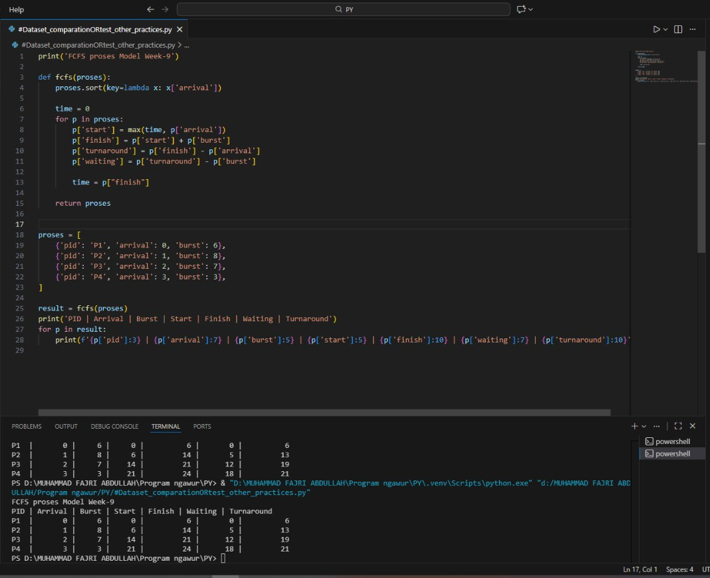

# Laporan Praktikum Minggu 9
Topik: Simulasi Algoritma Penjadwalan CPU

---

## Identitas
- **Nama**  : Muhammad Fajri Abdullah 
- **NIM**   : 250202979
- **Kelas** : 1IKRB

---

## Tujuan
1. Membuat program simulasi algoritma penjadwalan FCFS dan/atau SJF.
2. Menjalankan program dengan dataset uji yang diberikan atau dibuat sendiri.
3. Menyajikan output simulasi dalam bentuk tabel atau grafik.
4. Menjelaskan hasil simulasi secara tertulis.
5. Mengunggah kode dan laporan ke Git repository dengan rapi dan tepat waktu.
   
---

## Dasar Teori
- Penjadwalan CPU adalah mekanisme penting dalam sistem operasi untuk menentukan urutan eksekusi proses pada prosesor.
- Algoritma First-Come, First-Served (FCFS) bekerja dengan prinsip antrian, di mana proses yang datang lebih dahulu akan dieksekusi lebih dahulu, sehingga sederhana namun dapat menimbulkan masalah convoy effect.
- Algoritma Shortest Job First (SJF) memilih proses dengan burst time paling pendek, yang secara teoritis menghasilkan waktu rata-rata tunggu paling optimal, meskipun sulit diimplementasikan karena memerlukan prediksi akurat terhadap burst time. 

---

## Langkah Praktikum
1. **Menyiapkan Dataset**
   Buat dataset proses minimal berisi:

   | Proses | Arrival Time | Burst Time |
   |:--:|:--:|:--:|
   | P1 | 0 | 6 |
   | P2 | 1 | 8 |
   | P3 | 2 | 7 |
   | P4 | 3 | 3 |

2. **Implementasi Algoritma**
   Program harus:
   - Menghitung *waiting time* dan *turnaround time*.  
   - Mendukung minimal **1 algoritma (FCFS atau SJF non-preemptive)**.  
   - Menampilkan hasil dalam tabel.

3. **Eksekusi & Validasi**
   - Jalankan program menggunakan dataset uji.  
   - Pastikan hasil sesuai dengan perhitungan manual minggu sebelumnya.  
   - Simpan hasil eksekusi (screenshot).

4. **Analisis**
   - Jelaskan alur program.  
   - Bandingkan hasil simulasi dengan perhitungan manual.  
   - Jelaskan kelebihan dan keterbatasan simulasi.

5. **Commit & Push**
   
   ```bash
   git add .
   git commit -m "Minggu 9 - Simulasi Scheduling CPU"
   git push origin main
   ```


---

## Kode 

- Model FSCS

  
  
```bash
print('FCFS proses Model Week-9')

def fcfs(proses):
    proses.sort(key=lambda x: x['arrival'])

    time = 0
    for p in proses:
        p['start'] = max(time, p['arrival'])
        p['finish'] = p['start'] + p['burst']
        p['turnaround'] = p['finish'] - p['arrival']
        p['waiting'] = p['turnaround'] - p['burst']

        time = p["finish"]

    return proses


proses = [
    {'pid': 'P1', 'arrival': 0, 'burst': 6},
    {'pid': 'P2', 'arrival': 1, 'burst': 8},
    {'pid': 'P3', 'arrival': 2, 'burst': 7},
    {'pid': 'P4', 'arrival': 3, 'burst': 3},
]

result = fcfs(proses)
print('PID | Arrival | Burst | Start | Finish | Waiting | Turnaround')
for p in result:
    print(f'{p['pid']:3} | {p['arrival']:7} | {p['burst']:5} | {p['start']:5} | {p['finish']:10} | {p['waiting']:7} | {p['turnaround']:10}')

```

---

## Hasil Eksekusi
Sertakan screenshot hasil percobaan atau diagram:


---

## Tugas & Analisis
1. Buat program simulasi FCFS atau SJF.  
2. Jalankan program dengan dataset uji.  
3. Sajikan output dalam tabel atau grafik.  
4. Tulis laporan praktikum pada `laporan.md`.

- Jelaskan alur program.  
- Bandingkan hasil simulasi dengan perhitungan manual.  
- Jelaskan kelebihan dan keterbatasan simulasi.

....

---

## Kesimpulan
Tuliskan 2–3 poin kesimpulan dari praktikum ini.

---

## Quiz
1. Mengapa simulasi diperlukan untuk menguji algoritma scheduling?
   **Jawaban:**
   
2. Apa perbedaan hasil simulasi dengan perhitungan manual jika dataset besar?
   **Jawaban:**
   
3. Algoritma mana yang lebih mudah diimplementasikan? Jelaskan.
   **Jawaban:**
   

---

## Refleksi Diri
Tuliskan secara singkat:
- Apa bagian yang paling menantang minggu ini?  
- Bagaimana cara Anda mengatasinya?  

---

**Credit:**  
_Template laporan praktikum Sistem Operasi (SO-202501) – Universitas Putra Bangsa_
